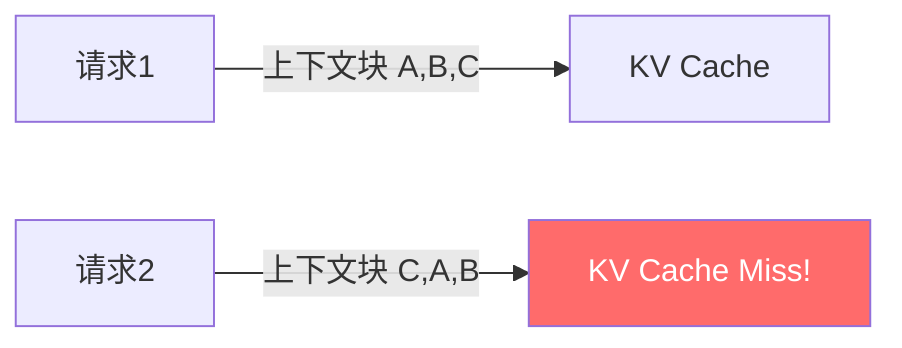
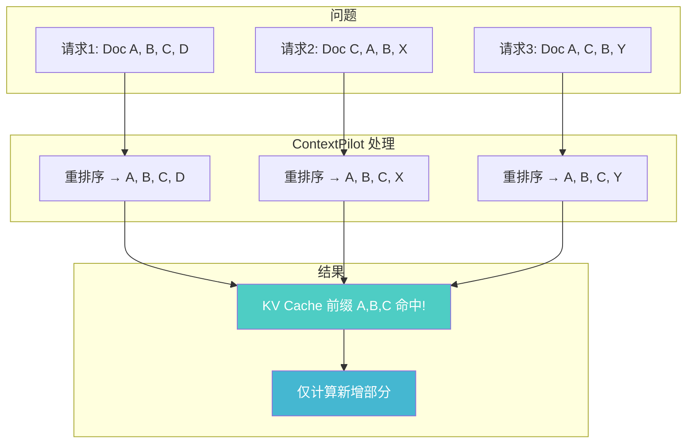
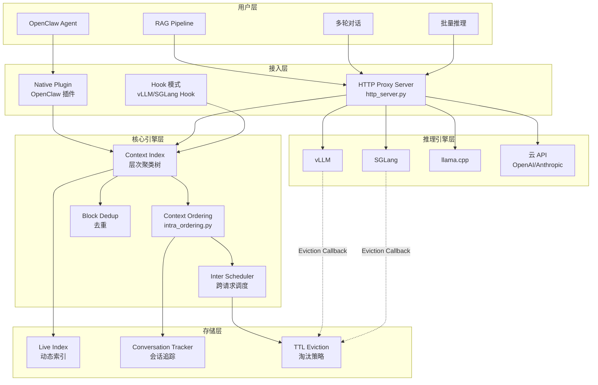
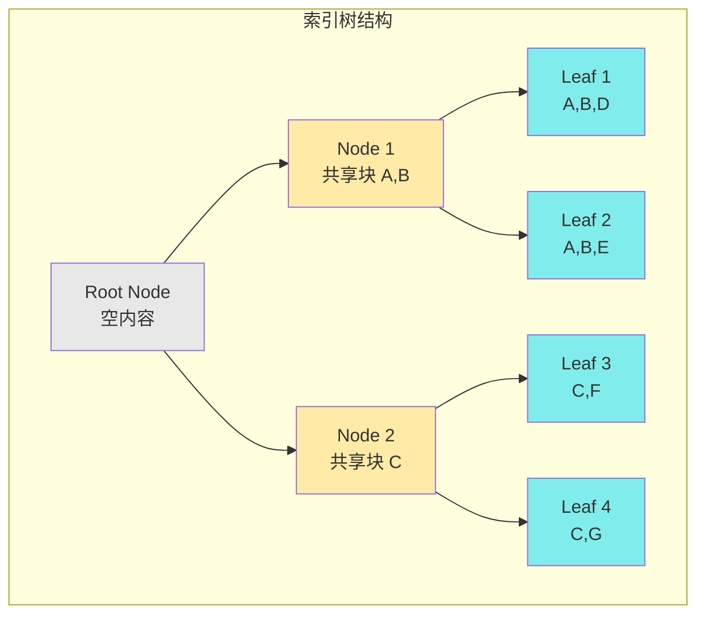
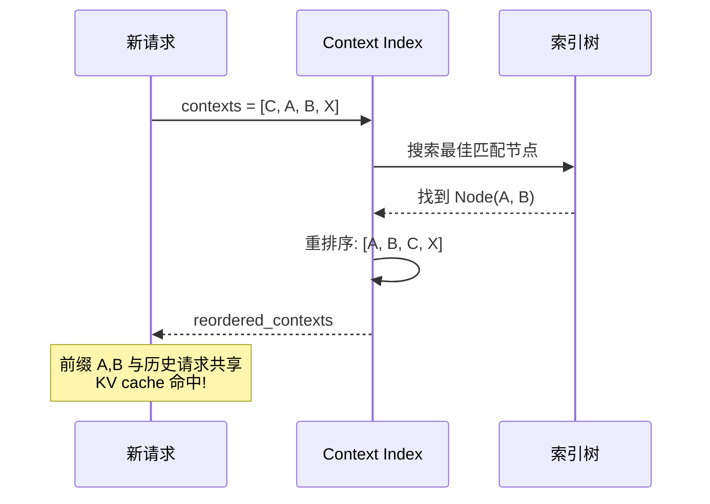
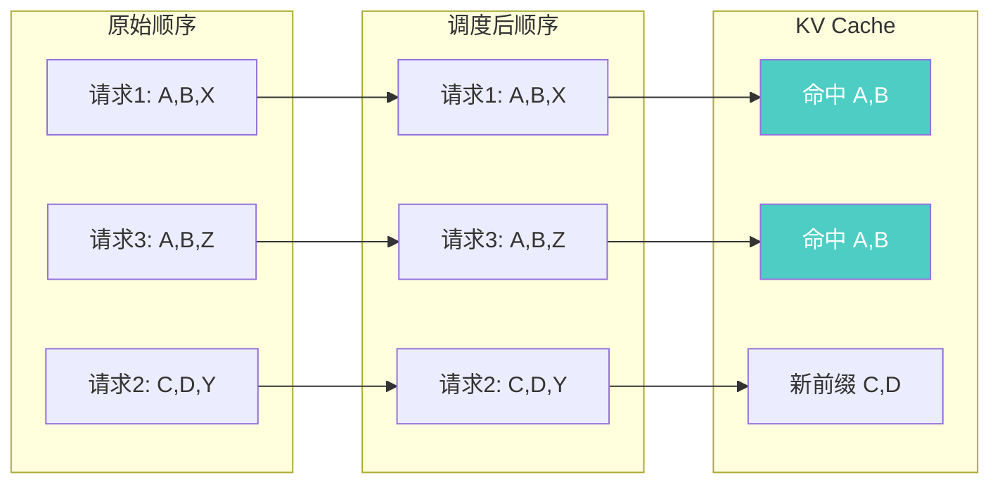
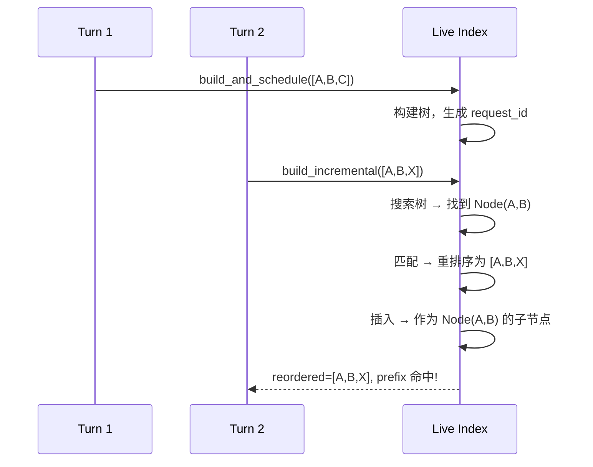
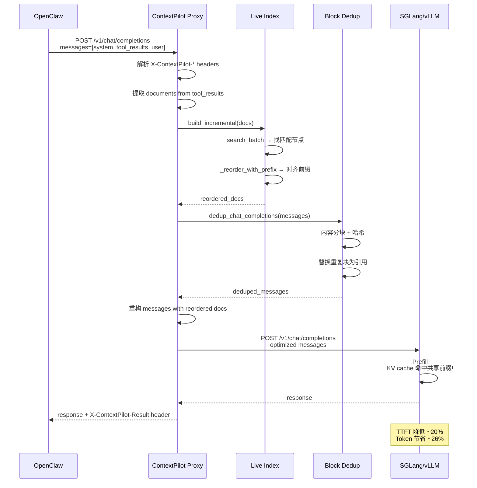
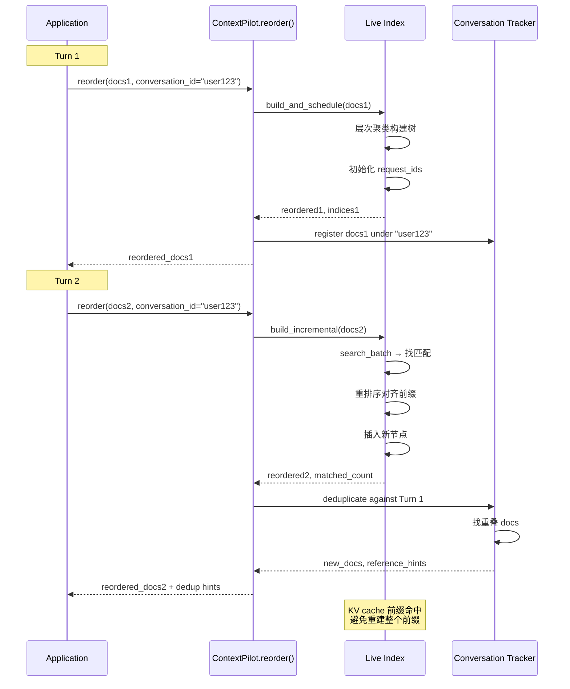
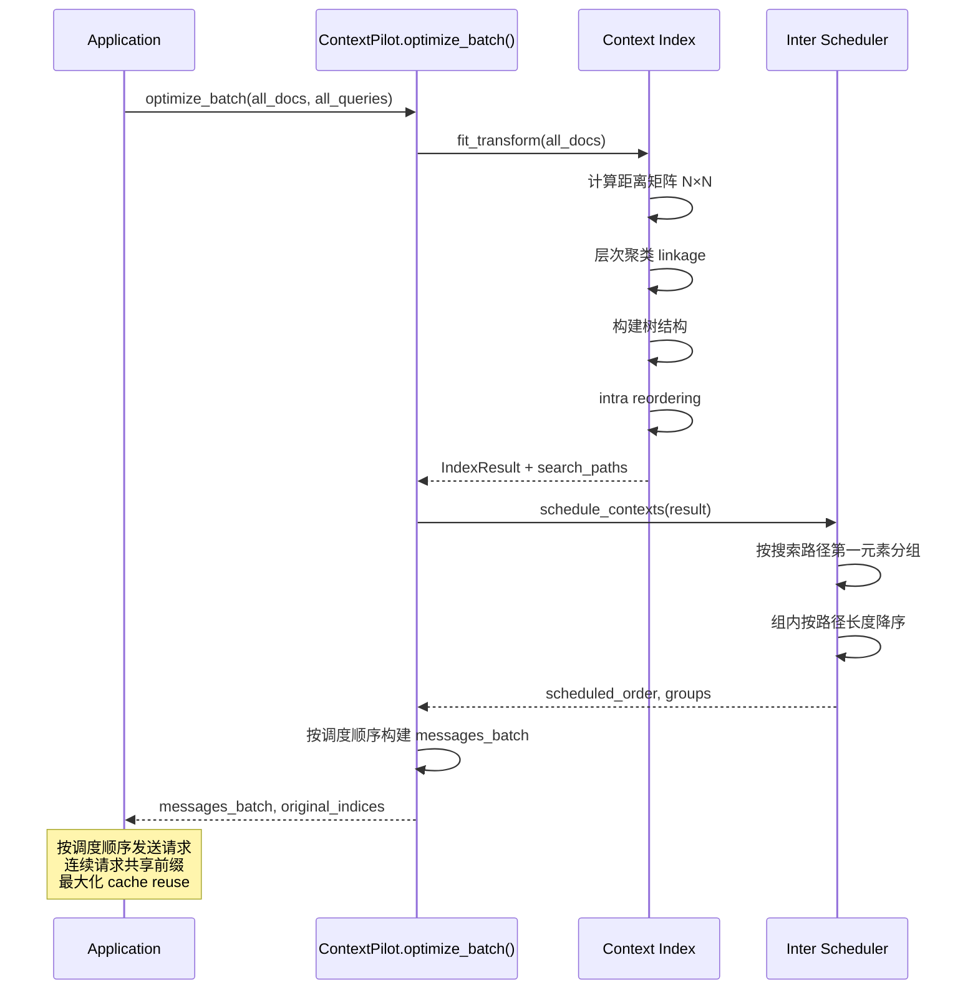

# ContextPilot 架构分析报告

## 一、项目概览

**项目定位：** ContextPilot 是一个用于加速长上下文推理的系统，通过**上下文重用**最大化 KV cache 命中率，显著降低 TTFT（Time To First Token）和减少 prefill 计算。

**核心指标：**
- 4–12× cache 命中率提升
- 1.5–3× prefill 加速
- ~36% token 节省

**代码规模：**
- 核心模块：约 50 个 Python 文件
- 测试文件：约 40 个
- 支持框架：vLLM、SGLang、llama.cpp、OpenClaw、云 API

---

## 二、KV Cache 命中率问题的根源

### 2.1 问题背景

在长上下文场景（RAG、多轮对话、Agent）中：



**问题核心：**
- 上下文块在不同请求间重叠但顺序不同
- Token 前缀变化 → KV cache miss → 重复计算

**典型场景：**
1. **RAG 检索：** 不同查询检索到相似文档但顺序不同
2. **多轮对话：** 历史记忆被重复引用
3. **Agent 工具调用：** 工具结果重复或相似
4. **批量推理：** 多个请求共享部分上下文

### 2.2 ContextPilot 解决方案



---

## 三、整体架构

### 3.1 架构图



### 3.2 模块职责说明

| 模块 | 文件 | 职责 |
|------|------|------|
| **Context Index** | `index_construction.py` | 构建层次聚类索引树，计算上下文距离 |
| **Tree Nodes** | `tree_nodes.py` | 节点管理，去重，树结构维护 |
| **Intra Ordering** | `intra_ordering.py` | 单请求内部上下文块重排序 |
| **Inter Scheduler** | `inter_scheduler.py` | 批量请求执行顺序调度 |
| **Live Index** | `live_index.py` | 动态索引，搜索、插入、淘汰 |
| **Block Dedup** | `block_dedup.py` | 内容级别的重复块去重 |
| **HTTP Server** | `http_server.py` | OpenAI 兼容代理，拦截重排序 |
| **Distance Compute** | `compute_distance_cpu.py` / `compute_distance_gpu.py` | 高效距离矩阵计算 |

### 3.3 架构特点分析

**分层设计：**
- 接入层：多种集成方式（HTTP Proxy、Native Plugin、Hook）
- 核心层：索引构建、重排序、调度、去重
- 存储层：动态索引管理、淘汰同步
- 推理层：适配多种推理引擎

**关键设计模式：**
- **策略模式：** 多种 Cloud Adapter 处理不同云 API
- **代理模式：** HTTP Server 作为中间代理
- **观察者模式：** Eviction Callback 同步缓存状态

---

## 四、核心技术详解：如何提高 KV Cache 命中率

### 4.1 核心：层次聚类索引树

**设计目标：** 识别上下文块之间的共享内容，构建树结构表示共享层级。



**关键代码 - [index_construction.py:65-98](contextpilot/context_index/index_construction.py#L65-L98):**

```python
class ContextIndex:
    def __init__(self, linkage_method="average", use_gpu=True, alpha=0.001):
        # alpha: 位置差异权重
        self.linkage_method = linkage_method  # 层次聚类方法
        self.use_gpu = use_gpu
        self.alpha = alpha  # 距离计算中的位置权重
        
    def fit_transform(self, contexts) -> IndexResult:
        # 1. 计算距离矩阵
        condensed_distances = self._compute_distance_matrix(contexts)
        
        # 2. 层次聚类
        linkage_matrix = linkage(condensed_distances, method=self.linkage_method)
        
        # 3. 构建树结构
        self._build_tree(contexts, linkage_matrix)
        
        # 4. 重排序上下文
        reordered_contexts = self.context_orderer.reorder_contexts(...)
```

**距离度量 - [compute_distance_cpu.py:12-47](contextpilot/context_index/compute_distance_cpu.py#L12-L47):**

```python
def compute_distance_single(context_a, context_b, alpha=0.001):
    """
    距离 = (1 - overlap/max_size) + alpha * avg_position_diff
    
    两部分：
    1. Jaccard overlap: 共享内容越多，距离越小
    2. Position diff: 位置差异越小，距离越小（鼓励前缀对齐）
    """
    intersection = set(pos_a.keys()) & set(pos_b.keys())
    
    # Overlap term
    overlap_term = 1.0 - (intersection_size / max_size)
    
    # Position term: 平均位置差异
    position_term = alpha * (position_diff_sum / intersection_size)
    
    return overlap_term + position_term
```

### 4.2 Intra-Context Ordering（单请求重排序）

**目标：** 将共享内容移到前缀位置，使 KV cache 能够命中。



**关键代码 - [intra_ordering.py:21-92](contextpilot/context_ordering/intra_ordering.py#L21-L92):**

```python
class IntraContextOrderer:
    def reorder_contexts(self, original_contexts, unique_nodes):
        """
        自顶向下遍历树：
        1. 每个节点继承父节点的前缀
        2. 叶节点的 doc_ids 即为最终重排序结果
        """
        # 从根节点开始 BFS
        queue = deque([root_node.node_id])
        
        while queue:
            node = unique_nodes[node_id]
            
            # 非根节点：重排序以父节点前缀开头
            if not node.is_root and node.parent:
                node.doc_ids = self._reorder_with_parent_prefix(
                    node.doc_ids, parent_node.doc_ids
                )
            
            # 继续处理子节点
            queue.extend(node.children)
```

**重排序示例 - [intra_ordering.py:160-189](contextpilot/context_ordering/intra_ordering.py#L160-L189):**

```python
def _reorder_with_parent_prefix(self, node_docs, parent_docs):
    """
    例: node=[2,3,4,1], parent=[1,2,3] → result=[1,2,3,4]
    
    父节点的前缀变成子节点的前缀，保持 cache 一致性
    """
    result = list(parent_docs)  # 先放父节点内容
    
    parent_set = set(parent_docs)
    for doc in node_docs:
        if doc not in parent_set:
            result.append(doc)  # 再放独特内容
    
    return result
```

### 4.3 Inter-Context Scheduling（跨请求调度）

**目标：** 批量请求时，优化执行顺序使相似前缀的请求连续执行。



**关键代码 - [inter_scheduler.py:29-72](contextpilot/context_ordering/inter_scheduler.py#L29-L72):**

```python
class InterContextScheduler:
    def schedule_contexts(self, clustering_result):
        """
        1. 按搜索路径的第一个元素分组（同一 cache 区域）
        2. 组内按路径长度降序（长前缀先执行）
        3. 字典序处理同长度请求（进一步对齐前缀）
        """
        # Step 1: O(N) 分组
        groups_by_root = self._group_by_root_prefix(search_paths)
        
        # Step 2: 组内排序 O(N log N)
        sorted_groups = self._sort_groups_by_path_length(...)
        
        # Step 3: 构建最终执行顺序
        final_order = [idx for group in sorted_groups for idx in group]
```

**分组逻辑 - [inter_scheduler.py:74-103](contextpilot/context_ordering/inter_scheduler.py#L74-L103):**

```python
def _group_by_root_prefix(self, search_paths):
    """
    搜索路径 [0, 1, 2] 表示：
    - 从 root 的第 0 个子节点
    - 再到第 1 个子节点
    - 再到第 2 个子节点
    
    第一个元素决定 cache 区域
    """
    groups = defaultdict(list)
    for context_idx, path in enumerate(search_paths):
        group_key = path[0]  # 第一个子节点索引
        groups[group_key].append(context_idx)
    return groups
```

### 4.4 Incremental Build（增量更新）

**目标：** 多轮对话中，动态更新索引，避免重建整个树。



**关键代码 - [live_index.py:460-631](contextpilot/server/live_index.py#L460-L631):**

```python
def build_incremental(self, contexts, initial_tokens=0):
    """
    增量构建算法：
    
    1. 批量搜索现有索引
       - 找到最佳匹配节点
       - 计算重叠度和是否有前缀
    
    2. 匹配的上下文：
       - has_prefix=True: 插入为子节点（共享前缀）
       - has_prefix=False: 插入为兄弟节点
    
    3. 无匹配的上下文：
       - 构建临时索引
       - 合并到全局 root
    """
    search_results = self.search_batch(contexts)
    
    for context, (path, matched_node_id, overlap, has_prefix) in zip(...):
        if overlap > 0 and matched_node_id >= 0:
            # 重排序以匹配节点的前缀开头
            reordered = self._reorder_with_prefix(context, matched_docs)
            
            if has_prefix and matched_node.is_leaf:
                # 分裂叶节点：共享前缀成为内部节点
                self._split_leaf_and_insert(reordered, matched_node, path)
            else:
                # 直接插入为子节点/兄弟节点
                self.insert(reordered, path)
        else:
            # 无匹配 → 新建索引
            unmatched_contexts.append(context)
```

**叶节点分裂 - [live_index.py:1491-1640](contextpilot/server/live_index.py#L1491-L1640):**

```python
def _split_leaf_and_insert(self, context, leaf_node, path, tokens):
    """
    分裂叶节点以共享前缀：
    
    Before: parent → leaf_A [a,b,c,d,e]
    After:  parent → internal [a,b,c]  (共享前缀)
                  ├── leaf_A [a,b,c,d,e]
                  └── leaf_B [a,b,c,x,y]  (新插入)
    
    这样两个叶节点共享前缀 [a,b,c]，cache 命中
    """
    # 计算连续共享前缀
    shared_prefix = []
    for a, b in zip(matched_docs, context):
        if a == b: shared_prefix.append(a)
        else: break
    
    # 创建内部节点（共享前缀）
    new_internal = ClusterNode(content=set(), doc_ids=shared_prefix)
    
    # 原叶节点和新叶节点作为子节点
    leaf_A.parent = new_internal.node_id
    leaf_B = ClusterNode(content=context, parent=new_internal.node_id)
```

### 4.5 Block Deduplication（内容去重）

**目标：** 识别重复的文本块，用引用提示替换，减少 token 数。

```mermaid
graph TB
    subgraph "原始 Tool Results"
        T1[Tool Result 1<br/>"...methodology section...<br/>Method X was used..."]
        T2[Tool Result 2<br/>"...methodology section...<br/>Method X was used...<br/>Additional details..."]
    end
    
    subgraph "去重后"
        D1[Tool Result 1<br/>"...methodology section...<br/>Method X was used..."]
        D2[Tool Result 2<br/>[..."methodology section"...<br/>— identical to earlier result, see above]<br/>Additional details...]
    end
    
    T1 --> D1
    T2 --> D2
    
    style D2 fill:#ffeaa7
```

**关键代码 - [block_dedup.py:53-157](contextpilot/dedup/block_dedup.py#L53-L157):**

```python
def _content_defined_chunking(text, chunk_modulus=13):
    """
    内容定义分块：基于内容哈希边界
    - 不是固定长度分块
    - 边界由内容决定，相同内容产生相同分块
    """
    for line in lines:
        current.append(line)
        line_hash = md5(line.strip()).digest()[:4]
        is_boundary = (line_hash % chunk_modulus == 0) or len(current) >= max_lines
        if is_boundary:
            blocks.append("\n".join(current))
            current = []

def _dedup_text(text, seen_blocks, msg_idx, fn_name, result):
    """
    对每个块：
    1. 计算 SHA256 哈希
    2. 检查是否已存在于 seen_blocks
    3. 重复 → 替换为引用提示
    """
    for block in blocks:
        h = sha256(block.strip()).hexdigest()[:20]
        
        if h in seen_blocks and seen_blocks[h][0] != msg_idx:
            # 重复块 → 替换为引用
            ref = f'[... "{first_line}" — identical to earlier {fn_name} result]'
            new_blocks.append(ref)
            result.chars_saved += len(block) - len(ref)
        else:
            seen_blocks[h] = (msg_idx, fn_name, block_idx)
            new_blocks.append(block)
```

---

## 五、核心调用链路

### 5.1 链路一：OpenClaw Agent 单次请求



### 5.2 链路二：多轮对话增量更新



### 5.3 链路三：批量离线推理调度



---

## 六、技术栈分析

### 6.1 技术栈清单

| 类别 | 技术 | 版本 | 使用场景 |
|------|------|------|----------|
| **语言** | Python | ≥3.10 | 核心实现 |
| **科学计算** | NumPy | - | 距离矩阵、数组操作 |
| **聚类** | SciPy (hierarchy) | - | 层次聚类 linkage |
| **并行计算** | multiprocessing | - | CPU 并行距离计算 |
| **GPU 计算** | CuPy (可选) | CUDA 12.x | GPU 加速距离矩阵 |
| **Web 框架** | FastAPI | - | HTTP Proxy Server |
| **HTTP 客户端** | aiohttp | - | 异步代理转发 |
| **推理引擎** | vLLM / SGLang | - | KV cache 管理 |
| **NLP** | transformers (可选) | - | Chat template tokenizer |
| **测试** | pytest | - | 单元/集成测试 |

### 6.2 关键技术详解

**1. 层次聚类 (Hierarchical Clustering)**

*为什么使用：*
- 自动发现上下文块的共享层级
- 无需预设簇数量
- 树结构天然表示前缀共享关系

*如何使用：*
```python
from scipy.cluster.hierarchy import linkage
linkage_matrix = linkage(condensed_distances, method="average")
```

**2. 内容定义分块 (Content-Defined Chunking)**

*为什么使用：*
- 固定长度分块对内容变化敏感
- 内容定义分块确保相同内容产生相同边界
- 去重更精确

*如何使用：*
```python
# Rabin fingerprint / rolling hash 思想
line_hash = md5(line.strip()).digest()[:4]
is_boundary = line_hash % modulus == 0
```

**3. Eviction Callback 同步**

*为什么使用：*
- 推理引擎的 KV cache 会自动淘汰
- ContextPilot 索引需要与实际 cache 状态同步
- 避免"假命中"（索引认为存在但已被淘汰）

*如何使用：*
```python
# SGLang hook
def eviction_callback(evicted_request_ids):
    requests.post(f"{CONTEXTPILOT_INDEX_URL}/evict", 
                  json={"request_ids": evicted_request_ids})
```

---

## 七、KV Cache 命中率优化总结

### 7.1 三种核心策略

| 策略 | 场景 | 效果 | 关键文件 |
|------|------|------|----------|
| **Intra Reordering** | 单请求内部 | 前缀对齐，cache 命中 | `intra_ordering.py` |
| **Inter Scheduling** | 批量请求 | 连续执行，最大化 reuse | `inter_scheduler.py` |
| **Block Dedup** | 跨请求重复 | Token 节省 ~36% | `block_dedup.py` |

### 7.2 算法复杂度

| 操作 | 复杂度 | 说明 |
|------|--------|------|
| 距离矩阵计算 | O(N² × L) | N=上下文数, L=平均长度 |
| 层次聚类 | O(N²) | linkage 算法 |
| 树搜索 | O(|C| × log N) | 单请求搜索 |
| 上下文插入 | O(|C|) 或 O(1) | 匹配/无匹配 |
| 批量调度 | O(N) + O(N log N) | 分组 + 组内排序 |

### 7.3 与 OpenClaw 集成方式

**方式一：Native Plugin（推荐）**
```bash
openclaw plugins install @contextpilot-ai/contextpilot
```
- 进程内运行，零外部依赖
- 自动拦截 tool_results 进行重排序

**方式二：HTTP Proxy**
```bash
python -m contextpilot.server.http_server --port 8765 --infer-api-url http://localhost:30000
```
- 配置 OpenClaw 使用 `http://localhost:8765/v1` 作为 base URL
- 代理转发 + 自动优化

---

## 八、总结与建议

### 8.1 架构优势

1. **通用性强：** 支持 RAG、多轮对话、Agent、批量推理等多种场景
2. **无侵入：** Drop-in 解决方案，无需修改现有代码
3. **高效：** GPU/CPU 并行，层次聚类，增量更新
4. **精准：** 内容定义分块，位置感知距离度量
5. **同步：** Eviction callback 保持索引与 cache 一致

### 8.2 潜在改进点

1. **GPU 加速覆盖：** 当前仅距离计算支持 GPU，聚类和重排序可进一步优化
2. **分布式支持：** 多实例场景的索引共享和同步机制
3. **自适应参数：** alpha、chunk_modulus 等参数的自适应调整
4. **更精细的去重：** 支持语义级去重而非仅字面重复

---

**参考资料：**
- Paper: [ContextPilot: Fast Long-Context Inference via Context Reuse](https://arxiv.org/abs/2511.03475)
- Documentation: [https://efficientcontext.github.io/contextpilot-docs/](https://efficientcontext.github.io/contextpilot-docs/)
- OpenClaw Integration: [examples/openclaw/README.md](examples/openclaw/README.md)