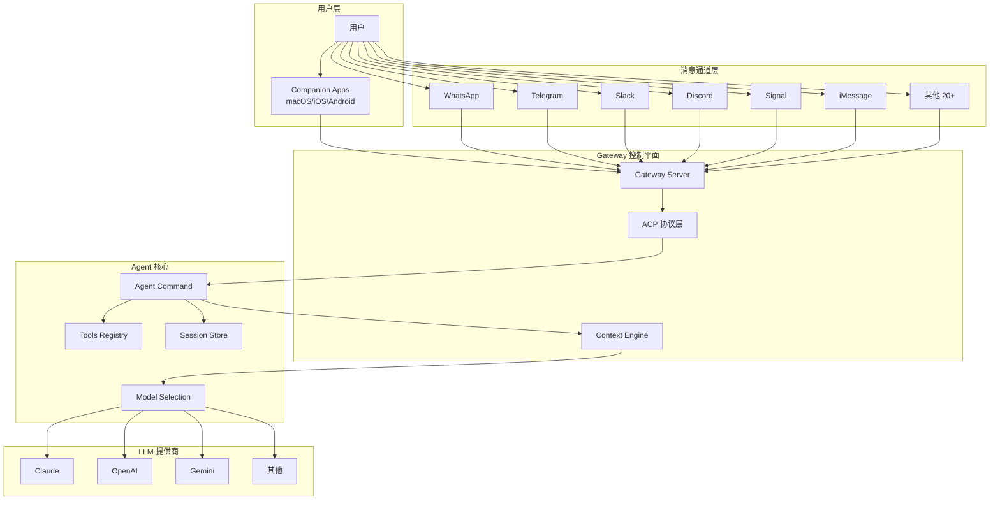
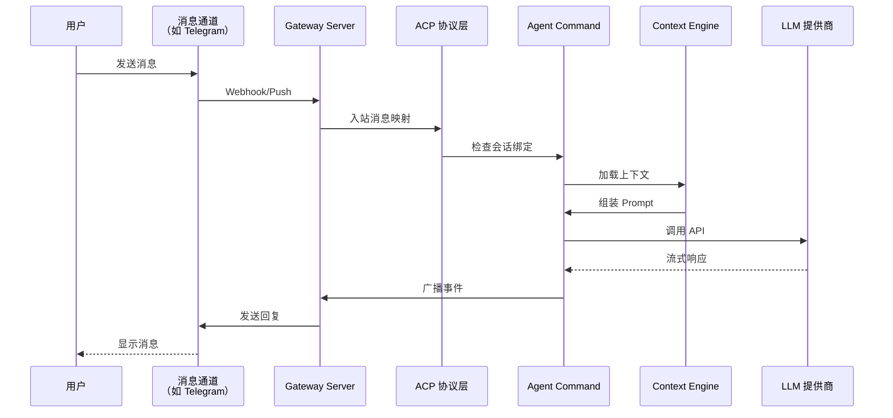
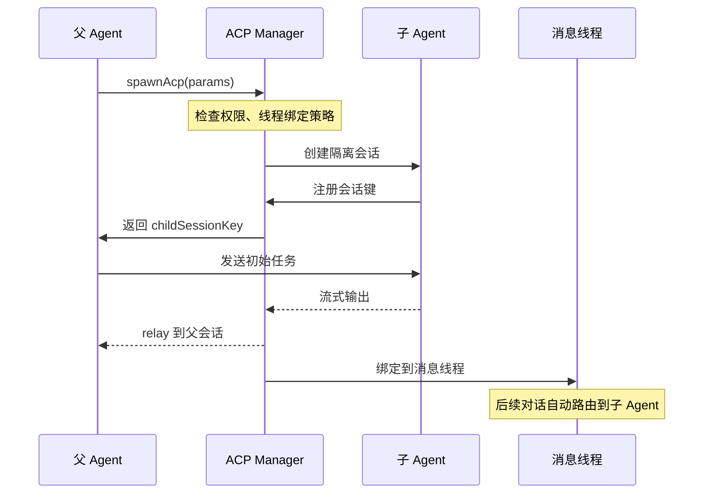

# OpenClaw Agent 范式介绍

> OpenClaw 是一个本地优先的多通道 AI 助手网关，其火爆的核心原因在于创新的 **Agent 架构范式**。

## 一、核心架构概览



## 二、十大核心 Agent 范式创新

### 1. 🔄 ACP (Agent Communication Protocol) 协议

**这是 OpenClaw 最核心的创新**

- **定义**：标准化 Agent 间通信协议，实现 Agent 会话的跨通道持久化
- **关键特性**：
  - **Thread Binding**：将 Agent 会话绑定到特定消息线程，实现跨对话上下文保持
  - **Persistent Binding**：持久绑定机制，Agent 会话可以跨多次对话激活
  - **Session Modes**：支持 `run`（单次任务）和 `session`（持久会话）两种模式
  - **Stream Relay**：子 Agent 输出流实时转发到父 Agent
- **代码位置**：`src/acp/` 目录（约 60+ 文件）
- **为什么重要**：解决了多轮对话、跨通道切换、子 Agent 协作的标准化问题

### 2. 🌐 多通道统一抽象

**26+ 消息通道的统一接口**

- **支持通道**：WhatsApp、Telegram、Slack、Discord、Signal、iMessage、Matrix、Feishu、LINE、Teams 等 26 种
- **统一抽象**：所有通道通过 `ChannelPlugin` 接口统一处理
  - `InboundReplyDispatch`：入站消息分发
  - `OutboundMedia`：出站媒体处理
  - `ReplyPayload`：统一回复 payload
- **代码位置**：`src/channels/` + `extensions/` (bundled plugins)
- **为什么重要**：用户无需在不同 App 间切换，一个 Agent 覆盖所有日常通讯

### 3. 🧠 Context Engine 可插拔上下文引擎

**灵活的上下文管理架构**

- **Registry 机制**：通过 `registerContextEngineForOwner()` 注册不同的上下文引擎
- **生命周期钩子**：
  - `bootstrap()`：会话初始化
  - `maintain()`：上下文维护
  - `ingest()`：消息摄入
  - `compact()`：上下文压缩
  - `assemble()`：Prompt 组装
- **Session Key Compat**：自动处理遗留 sessionKey 参数兼容
- **代码位置**：`src/context-engine/registry.ts`
- **为什么重要**：允许替换不同的记忆/上下文策略，而不影响核心 Agent 流程

### 4. 🔌 Plugin SDK 清晰的扩展边界

**核心与插件严格隔离**

- **公开接口**：`openclaw/plugin-sdk/*` 是唯一的外部插件接口（有 200+ 子路径导出）
- **核心隔离**：插件不能直接 import `src/**` 核心代码
- **插件类型**：
  - **Channel Plugins**：消息通道实现
  - **Provider Plugins**：LLM 提供商集成
  - **Capability Plugins**：能力扩展（如 browser、canvas）
- **代码位置**：`src/plugin-sdk/` + `src/plugins/` (加载器/注册表)
- **为什么重要**：第三方开发者可以安全扩展，核心保持稳定

### 5. 🎯 Agent Scope 多 Agent 路由

**一个 Gateway，多个独立 Agent**

- **路由策略**：将不同通道/账号/对等体路由到隔离的 Agent 工作空间
- **配置示例**：
  ```yaml
  agents:
    defaults:
      provider: anthropic
      model: claude-sonnet-4-6
    work:
      provider: openai
      model: gpt-5.4
      skillsFilter: ["work-*"]
  routing:
    entries:
      - match: { channel: "slack", accountId: "work-team" }
        agentId: "work"
  ```
- **Session Store**：每个 Agent 有独立的会话存储和配置
- **代码位置**：`src/agents/agent-scope.ts` + `src/routing/`
- **为什么重要**：工作/个人场景分离，多用户场景支持

### 6. 💾 Prompt Cache Stability 缓存优化

**显著的 API 成本优化**

- **Cache Boundary**：系统提示中使用 `<!-- OPENCLAW_CACHE_BOUNDARY -->` 分隔符
- **Stable Prefix**：分隔符前的内容在对话轮次间保持字节级稳定
- **Dynamic Suffix**：分隔符后的动态内容可以每轮变化
- **确定性组装**：所有从 Map/Set/Registry 组装的内容必须排序后构建
- **代码位置**：`src/agents/system-prompt-cache-boundary.ts`
- **为什么重要**：Anthropic Prompt Caching 可节省 90%+ Token 成本

### 7. 🔐 安全优先设计

**生产级安全默认**

- **DM Pairing**：默认 DM 需要配对码确认（防止陌生消息滥用）
- **Allowlist**：只有白名单用户可以触发 Agent
- **Sandbox Mode**：非 main 会话自动 Docker 沙箱隔离
- **SSRF Policy**：严格的 SSRF 防护策略
- **Secret Resolution**：SecretRef 安全凭证管理
- **代码位置**：`src/security/` + `src/config/types.secrets.ts`
- **为什么重要**：生产环境可以直接部署，不担心安全漏洞

### 8. 🛠️ First-class Tools 一流工具支持

**Agent 不是聊天机器人，是执行引擎**

- **核心工具**：
  - `browser`：浏览器控制（Playwright）
  - `canvas`：可视化画布（A2UI）
  - `sessions_*`：会话管理（list/history/send/spawn）
  - `cron`：定时任务
  - `discord`/`slack` actions：平台特定操作
  - `mcp`：MCP 协议工具集成
- **Tool Registry**：统一的工具注册和权限管理
- **代码位置**：`src/tools/` + 各 extension `tools.ts`
- **为什么重要**：Agent 可以执行复杂自动化，不仅仅是问答

### 9. 🔄 Gateway Protocol 类型化协议

**控制平面与节点通信的标准化**

- **Schema 定义**：`src/gateway/protocol/schema.ts` 定义所有消息类型
- **Typed Wire Protocol**：WebSocket 通信的强类型定义
- **Client Types**：自动生成客户端类型（Swift、TypeScript）
- **版本兼容**：协议变更需要版本化，保证向后兼容
- **代码位置**：`src/gateway/protocol/`
- **为什么重要**：多客户端（macOS/iOS/Android/CLI）可以稳定接入

### 10. 📱 Companion Apps 生态整合

**原生应用体验**

- **macOS App**：
  - Menu Bar 控制
  - Voice Wake（语音唤醒）
  - Canvas 可视化
  - Remote Gateway 控制
- **iOS/Android Nodes**：
  - 设备配对
  - 语音触发转发
  - Canvas surface
- **Web UI**：
  - Control UI（Web 管理界面）
  - WebChat（Web 聊天）
- **代码位置**：`apps/` + `ui/`
- **为什么重要**：无缝的跨设备体验，本地优先但不限于本地

## 三、核心调用链路示例

### 链路一：用户消息 → Agent 响应



### 铿路二：Spawn 子 Agent（ACP Spawn）



## 四、技术栈清单

| 类别 | 技术 | 用途 |
|------|------|------|
| 语言框架 | TypeScript (ESM) + Node 22+ | 核心运行时 |
| 构建 | tsdown + Bun | 快速打包与执行 |
| 测试 | Vitest + V8 Coverage | 单元测试与覆盖率 |
| Lint | Oxlint + Oxfmt | Rust-based 快速检查 |
| 数据存储 | LanceDB (向量) + SQLite-vec | 嵌入向量存储 |
| 浏览器 | Playwright Core | 浏览器自动化 |
| 协议 | MCP SDK + ACP SDK | 工具协议与 Agent 协议 |
| 消息 | 各 SDK (grammy, matrix-js-sdk, 等) | 通道集成 |
| 客户端 | Swift (iOS/macOS) + Kotlin (Android) | 原生应用 |

## 五、架构优势总结

### ✅ 为什么 OpenClaw 能火爆？

1. **解决了真实痛点**：多通道统一 + 本地隐私 + 持久上下文
2. **架构清晰**：ACP 协议标准化了 Agent 通信，Plugin SDK 标准化了扩展
3. **生产可用**：安全默认 + Docker 沙箱 + 配对机制
4. **成本优化**：Prompt Caching + 本地执行 = 低成本高效率
5. **开发者友好**：清晰的边界 + 类型化协议 + 详细文档
6. **跨设备体验**：macOS/iOS/Android + Voice Wake + Canvas

### 🔮 适合学习的范式

1. **Plugin Architecture**：如何设计清晰的扩展边界
2. **Protocol Design**：ACP 协议如何标准化 Agent 通信
3. **Context Management**：可插拔上下文引擎的设计模式
4. **Security Defaults**：如何在默认配置中嵌入安全策略
5. **Prompt Engineering**：Cache Boundary 稳定性设计

---

## 六、快速上手

```bash
# 安装
npm install -g openclaw@latest

# 启动网关
openclaw onboard --install-daemon
openclaw gateway --port 18789

# 与 Agent 对话
openclaw agent --message "帮我分析项目架构" --thinking high

# 发送消息到通道
openclaw message send --to +1234567890 --message "Hello"
```

## 七、推荐阅读顺序

1. [README.md](README.md) - 项目概览
2. [AGENTS.md](AGENTS.md) - 架构边界与开发规范（详细）
3. [src/acp/](src/acp/) - ACP 协议实现（核心创新）
4. [src/agents/](src/agents/) - Agent 命令与模型选择
5. [src/plugin-sdk/](src/plugin-sdk/) - 公开插件接口
6. [src/gateway/protocol/](src/gateway/protocol/) - Gateway 协议

---

**文档生成日期**：2026-04-21  
**OpenClaw 版本**：2026.4.15-beta.1