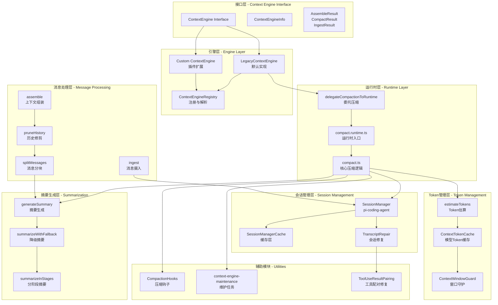
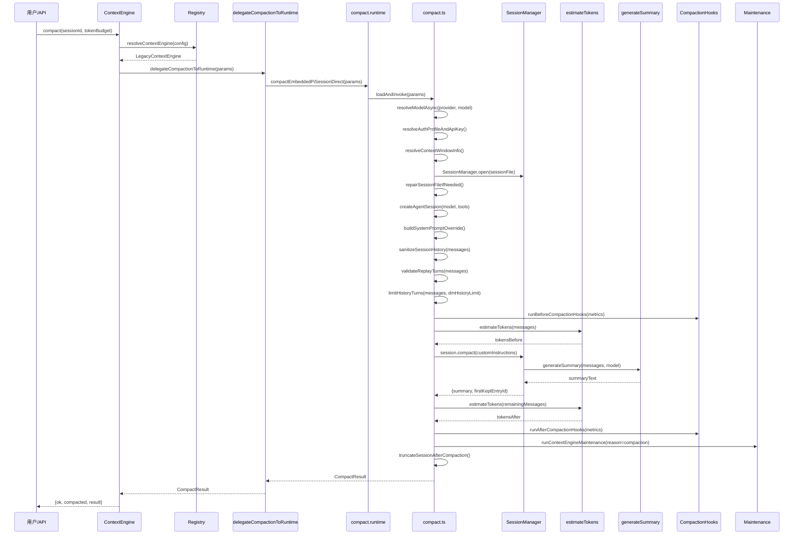
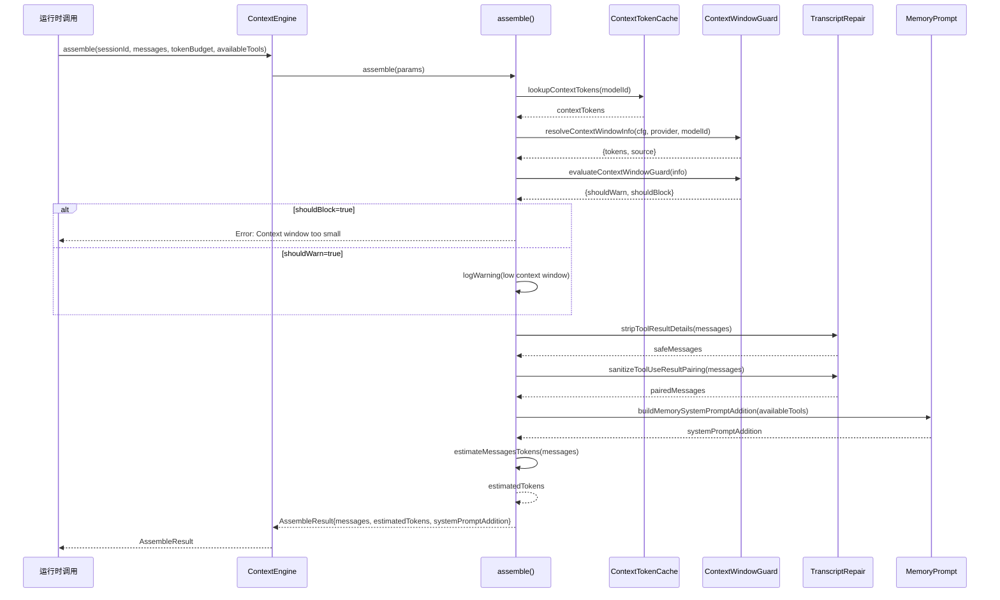
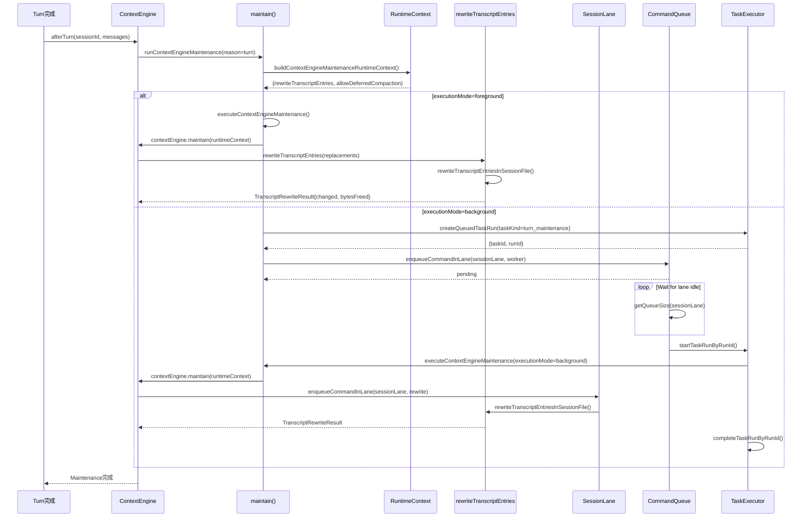

# OpenClaw Context Engineering 上下文管理架构分析报告

## 一、项目概览

### 1.1 项目定位

OpenClaw是一个开源的AI编程助手项目，其Context Engineering模块负责管理LLM对话的上下文生命周期，包括：
- **上下文窗口管理**：跟踪模型上下文窗口大小，防止溢出
- **消息生命周期**：管理对话历史的摄入、组装、压缩和维护
- **Token计数**：估算和管理上下文Token使用量
- **智能压缩**：通过摘要生成和消息修剪控制上下文大小

### 1.2 代码规模概览

| 模块               | 文件数 | 核心代码行数 |
| ------------------ | ------ | ------------ |
| context-engine     | 8      | ~500         |
| compaction核心     | 15+    | ~3500        |
| session管理        | 10+    | ~2000        |
| pi-embedded-runner | 80+    | ~15000+      |

---

## 二、整体架构

### 2.1 架构图



### 2.2 模块职责说明

#### 核心接口层

| 模块                  | 文件路径                                                   | 职责描述                                                                                                              |
| --------------------- | ---------------------------------------------------------- | --------------------------------------------------------------------------------------------------------------------- |
| **ContextEngine**     | [src/context-engine/types.ts](src/context-engine/types.ts) | 定义上下文引擎的核心接口契约，包含`bootstrap`、`ingest`、`assemble`、`compact`、`maintain`、`afterTurn`等生命周期方法 |
| **ContextEngineInfo** | [src/context-engine/types.ts](src/context-engine/types.ts) | 描述引擎元数据：`id`、`name`、`version`、`ownsCompaction`、`turnMaintenanceMode`                                      |

#### 引擎实现层

| 模块                            | 文件路径                                                         | 职责描述                                                                                                                                |
| ------------------------------- | ---------------------------------------------------------------- | --------------------------------------------------------------------------------------------------------------------------------------- |
| **LegacyContextEngine**         | [src/context-engine/legacy.ts](src/context-engine/legacy.ts)     | 默认上下文引擎实现，包装现有压缩行为，提供100%向后兼容。`ingest`为空操作（SessionManager处理），`assemble`为透传，`compact`委托给运行时 |
| **ContextEngineRegistry**       | [src/context-engine/registry.ts](src/context-engine/registry.ts) | 全局注册表，管理引擎工厂函数，支持核心引擎和第三方插件注册，解析配置中的引擎选择                                                        |
| **delegateCompactionToRuntime** | [src/context-engine/delegate.ts](src/context-engine/delegate.ts) | 桥接函数，将引擎压缩请求委托给OpenClaw内置运行时压缩路径                                                                                |

#### 运行时压缩层

| 模块                   | 文件路径                                                                                             | 职责描述                                                                                                                        |
| ---------------------- | ---------------------------------------------------------------------------------------------------- | ------------------------------------------------------------------------------------------------------------------------------- |
| **compact.runtime.ts** | [src/agents/pi-embedded-runner/compact.runtime.ts](src/agents/pi-embedded-runner/compact.runtime.ts) | 运行时入口，动态加载压缩模块，提供`compactEmbeddedPiSessionDirect`函数                                                          |
| **compact.ts**         | [src/agents/pi-embedded-runner/compact.ts](src/agents/pi-embedded-runner/compact.ts)                 | 核心压缩逻辑实现（1200+行），处理会话文件修复、模型解析、认证、系统提示构建、历史验证、Tool配对修复、摘要生成、后处理等完整流程 |
| **compaction.ts**      | [src/agents/compaction.ts](src/agents/compaction.ts)                                                 | 提供Token估算、消息分块、历史修剪、摘要生成辅助函数，被compact.ts调用                                                           |

#### Token管理层

| 模块                        | 文件路径                                                                 | 职责描述                                                                                       |
| --------------------------- | ------------------------------------------------------------------------ | ---------------------------------------------------------------------------------------------- |
| **context.ts**              | [src/agents/context.ts](src/agents/context.ts)                           | 上下文Token查找核心，解析模型上下文窗口配置，支持从models.json、配置文件、运行时发现等多源获取 |
| **context-cache.ts**        | [src/agents/context-cache.ts](src/agents/context-cache.ts)               | 模型上下文Token缓存（Map结构），存储`modelId -> contextTokens`映射                             |
| **context-window-guard.ts** | [src/agents/context-window-guard.ts](src/agents/context-window-guard.ts) | 上下文窗口守护，检查最小阈值（16K）、警告阈值（32K），支持阻止和警告两种模式                   |
| **estimateTokens**          | pi-coding-agent                                                          | Token估算函数，基于字符数/4启发式方法计算Token数量                                             |

#### 会话管理层

| 模块                             | 文件路径                                                                                                         | 职责描述                                                              |
| -------------------------------- | ---------------------------------------------------------------------------------------------------------------- | --------------------------------------------------------------------- |
| **SessionManager**               | @mariozechner/pi-coding-agent                                                                                    | 底层会话管理器，处理消息持久化、DAG结构、分支管理                     |
| **session-manager-cache.ts**     | [src/agents/pi-embedded-runner/session-manager-cache.ts](src/agents/pi-embedded-runner/session-manager-cache.ts) | SessionManager缓存层，避免频繁重新打开会话文件，支持预预热（prewarm） |
| **session-transcript-repair.ts** | [src/agents/session-transcript-repair.ts](src/agents/session-transcript-repair.ts)                               | 会话转录修复，处理Tool-use/Tool-result配对问题，清除敏感details字段   |
| **session-tool-result-guard.ts** | [src/agents/session-tool-result-guard.ts](src/agents/session-tool-result-guard.ts)                               | Tool结果守护，防止恶意或超大tool_result污染上下文                     |

#### 维护与钩子层

| 模块                              | 文件路径                                                                                                                   | 职责描述                                                                |
| --------------------------------- | -------------------------------------------------------------------------------------------------------------------------- | ----------------------------------------------------------------------- |
| **context-engine-maintenance.ts** | [src/agents/pi-embedded-runner/context-engine-maintenance.ts](src/agents/pi-embedded-runner/context-engine-maintenance.ts) | 维护任务调度，支持前台/后台执行模式，处理转录重写请求，管理延迟维护队列 |
| **compaction-hooks.ts**           | [src/agents/pi-embedded-runner/compaction-hooks.ts](src/agents/pi-embedded-runner/compaction-hooks.ts)                     | 压缩前后钩子，执行`beforeCompaction`和`afterCompaction`插件钩子         |

### 2.3 架构特点分析

#### 分层方式

采用**六层架构**设计：
1. **接口层**：定义核心契约，隔离实现变化
2. **引擎层**：可插拔引擎实现，支持第三方扩展
3. **运行时层**：执行核心业务逻辑
4. **会话层**：管理持久化和状态
5. **Token层**：资源预算管理
6. **消息层**：数据流处理

#### 通信模式

- **同步调用**：Token查找、消息组装、上下文窗口检查
- **异步委托**：压缩操作、摘要生成、会话维护
- **事件钩子**：`beforeCompaction`/`afterCompaction`/`afterTurn`生命周期钩子
- **队列化执行**：通过`command-queue`实现会话lane隔离，避免并发冲突

#### 设计亮点

1. **插件化引擎架构**：通过Registry支持注册自定义ContextEngine，配置可通过`plugins.slots.contextEngine`选择引擎
2. **渐进式降级**：摘要生成支持`summarizeWithFallback`，在超大数据时逐步降级
3. **Tool配对修复**：自动修复tool_use/tool_result配对问题，防止API错误
4. **上下文窗口自适应**：支持从配置、模型发现、运行时等多源解析上下文窗口，应用最小保守限制
5. **会话缓存预热**：通过OS页面缓存预热减少IO延迟

---

## 三、技术栈分析

### 3.1 技术栈清单

| 类别         | 技术                          | 版本/来源 | 使用场景                                                      |
| ------------ | ----------------------------- | --------- | ------------------------------------------------------------- |
| **核心依赖** | @mariozechner/pi-coding-agent | 外部库    | 提供SessionManager、estimateTokens、generateSummary等核心能力 |
| **核心依赖** | @mariozechner/pi-agent-core   | 外部库    | AgentMessage类型定义、AgentBlock结构                          |
| **语言框架** | TypeScript                    | Node.js   | 项目主语言，严格类型检查                                      |
| **运行时**   | Node.js                       | 18+       | 执行环境，支持ESM模块                                         |
| **配置管理** | OpenClawConfig                | 内部      | YAML/JSON配置文件，控制上下文参数                             |
| **任务调度** | command-queue                 | 内部      | Lane队列系统，隔离会话操作                                    |
| **缓存机制** | ExpiringMapCache              | 内部      | TTL缓存，防止内存泄漏                                         |
| **安全机制** | secure-random                 | 内部      | 安全随机数生成，用于diagId                                    |
| **日志系统** | subsystem-logger              | 内部      | 子系统日志，支持debug/info/warn分级                           |

### 3.2 关键技术详解

#### @mariozechner/pi-coding-agent 核心依赖

这是OpenClaw上下文管理的核心引擎来源，提供：

```typescript
// 核心导入
import {
  SessionManager,      // 会话持久化管理器
  estimateTokens,      // Token估算函数
  generateSummary,     // 摘要生成函数
  createAgentSession,  // 创建Agent会话
  DefaultResourceLoader // 资源加载器
} from "@mariozechner/pi-coding-agent";
```

**为什么使用**：
- 提供成熟的会话DAG结构管理
- 封装了与Claude API交互的底层逻辑
- 内置Token估算和摘要生成能力

**如何使用**：
- `SessionManager.open(sessionFile)` 打开或创建会话文件
- `session.compact(customInstructions)` 执行压缩操作
- `estimateTokens(message)` 估算单条消息Token

#### Token估算策略

```typescript
// 基础启发式方法
export const SAFETY_MARGIN = 1.2; // 20%缓冲

export function estimateMessagesTokens(messages: AgentMessage[]): number {
  const safe = stripToolResultDetails(messages); // 安全清理
  return safe.reduce((sum, msg) => sum + estimateTokens(msg), 0);
}
```

**为什么不精确**：
- 字符数/4是启发式方法，不考虑多字节字符
- 特殊Token（如代码Token）可能被低估
- 因此使用1.2倍安全缓冲

#### 消息分块算法

```typescript
export function splitMessagesByTokenShare(
  messages: AgentMessage[],
  parts = DEFAULT_PARTS // 默认2部分
): AgentMessage[][] {
  // 按Token份额智能分割
  // 维护tool_use/tool_result配对完整性
  // 使用pendingToolCallIds跟踪未配对工具调用
}
```

**设计要点**：
- 不会在tool_use和tool_result之间分割
- 使用`pendingChunkStartIndex`标记分割边界
- 支持动态parts参数控制分割数量

#### 上下文窗口解析优先级

```typescript
// resolveContextTokensForModel 解析优先级
1. contextTokensOverride（显式覆盖）
2. 配置文件中的 models.providers[].models[].contextTokens
3. 模型发现的 qualified key（provider/model）
4. 模型发现的 bare key（model）
5. fallbackContextTokens（兜底值）
```

---

## 四、核心调用链路

### 4.1 链路一：上下文压缩完整流程



#### 详细说明

**1. 引擎选择阶段**
- 通过`resolveContextEngine(config)`从配置解析引擎
- 支持配置覆盖：`config.plugins.slots.contextEngine`
- 失败时自动回退到默认`LegacyContextEngine`

**2. 认证与模型解析阶段**
- `resolveModelAsync`解析provider/model组合
- `getApiKeyForModel`获取认证信息
- 支持多认证模式：API key、AWS SDK、OAuth等

**3. 上下文窗口计算阶段**
- 从`modelsConfig`、模型发现、配置等多源解析
- 应用`agents.defaults.contextTokens`上限
- 计算`effectiveModel`上下文窗口

**4. 会话准备阶段**
- `repairSessionFileIfNeeded`修复损坏会话文件
- `prewarmSessionFile`预热OS页面缓存
- `acquireSessionWriteLock`获取写锁防止并发

**5. 历史处理阶段**
- `sanitizeSessionHistory`清理敏感字段
- `validateReplayTurns`验证重放Turn完整性
- `limitHistoryTurns`应用DM历史限制
- `sanitizeToolUseResultPairing`修复配对

**6. 压缩执行阶段**
- `runBeforeCompactionHooks`执行前置钩子
- `session.compact()`调用底层压缩
- 内部使用`generateSummary`生成摘要
- 计算压缩前后Token变化

**7. 后处理阶段**
- `runAfterCompactionHooks`执行后置钩子
- `hardenManualCompactionBoundary`固化手动边界
- `truncateSessionAfterCompaction`清理压缩后数据
- `persistSessionCompactionCheckpoint`保存检查点

---

### 4.2 链路二：上下文组装流程



#### 详细说明

**1. Token预算解析**
- 从缓存查找模型上下文Token限制
- 解析配置覆盖和运行时发现值
- 应用保守策略（使用最小值防止溢出）

**2. 上下文窗口守护**
- 检查是否低于硬性最小值（16K）
- 检查是否低于警告阈值（32K）
- 区分来源：model、modelsConfig、agentContextTokens、default

**3. 消息安全处理**
- `stripToolResultDetails`移除敏感`details`字段
- 保留核心tool_result信息，去除可能恶意的大payload

**4. Tool配对验证**
- 确保每个tool_result有对应的tool_use
- 移除孤立tool_result防止API错误

**5. 系统提示增强**
- 可选添加memory/wiki指导提示
- 根据availableTools过滤工具提示

---

### 4.3 链路三：会话维护与转录重写



#### 详细说明

**1. 触发时机**
- `afterTurn`在每个Turn完成后调用
- `bootstrap`在会话初始化时调用
- `compaction`在压缩完成后调用

**2. 执行模式选择**
- 检查`contextEngine.info.turnMaintenanceMode`
- `foreground`：立即执行，阻塞主流程
- `background`：延迟执行，通过任务队列调度

**3. 运行时上下文构建**
- 提供`rewriteTranscriptEntries`安全重写函数
- 设置`allowDeferredCompactionExecution`标志
- 传递Token预算和Prompt缓存信息

**4. 后台模式细节**
- 创建`TURN_MAINTENANCE_TASK_KIND`任务
- 等待会话lane空闲后再执行
- 支持长运行提醒（10秒后显示进度）
- 处理SIGINT/SIGTERM中断信号

**5. 转录重写**
- 接收`TranscriptRewriteRequest`请求
- 包含`entryId`和替换`message`
- 执行分支-追加操作更新会话DAG
- 计算释放字节数和重写条目数

---

## 五、上下文管理工作流程示例

### 场景描述

**用户场景**：用户在与AI助手进行长时间代码讨论后，触发手动压缩操作（`/compact`命令）。此时会话包含：
- 50条对话消息
- 多个tool_use/tool_result（文件读取、bash执行）
- 当前Token估算：180K tokens
- 模型上下文窗口：200K tokens
- 配置上限：100K tokens

### 完整工作流程

```mermaid
graph TB
    START[用户触发/compact] --> CMD[命令解析]
    CMD --> SESSION_KEY[解析sessionKey]
    
    SESSION_KEY --> CE_RESOLVE[resolveContextEngine]
    CE_RESOLVE --> |config.plugins.slots<br/>默认legacy| LEGACY[LegacyContextEngine]
    
    LEGACY --> COMPACT_CALL[compact参数构建]
    COMPACT_CALL --> |sessionId<br/>sessionFile<br/>tokenBudget=100K<br/>force=true| DELEGATE[delegateCompactionToRuntime]
    
    DELEGATE --> LOAD_RT[动态加载compact.runtime]
    LOAD_RT --> COMPACT_DIRECT[compactEmbeddedPiSessionDirect]
    
    subgraph COMPACT_PHASE ["压缩准备阶段"]
        COMPACT_DIRECT --> MODEL_RESOLVE[resolveModelAsync<br/>anthropic/claude-opus-4]
        MODEL_RESOLVE --> AUTH_RESOLVE[getApiKeyForModel<br/>解析API认证]
        AUTH_RESOLVE --> WINDOW_RESOLVE[resolveContextWindowInfo<br/>tokens=100K<br/>source=agentContextTokens]
        WINDOW_RESOLVE --> GUARD_CHECK[evaluateContextWindowGuard<br/>shouldWarn=false<br/>shouldBlock=false]
    end
    
    subgraph SESSION_PHASE ["会话处理阶段"]
        GUARD_CHECK --> SESSION_LOCK[acquireSessionWriteLock<br/>maxHold=300s]
        SESSION_LOCK --> REPAIR_FILE[repairSessionFileIfNeeded]
        REPAIR_FILE --> PREWARM[prewarmSessionFile<br/>预热OS缓存]
        PREWARM --> SESSION_OPEN[SessionManager.open<br/>加载50条消息]
        SESSION_OPEN --> GUARD_WRAP[guardSessionManager<br/>配置tool结果守护]
    end
    
    subgraph HISTORY_PHASE ["历史处理阶段"]
        GUARD_WRAP --> CREATE_SESSION[createAgentSession<br/>model+tools+settings]
        CREATE_SESSION --> SANITIZE[sanitizeSessionHistory<br/>strip toolResult.details]
        SANITIZE --> VALIDATE[validateReplayTurns<br/>检查tool配对完整性]
        VALIDATE --> LIMIT_DM[limitHistoryTurns<br/>dmHistoryLimit=20<br/>保留最近20轮]
        LIMIT_DM --> REPAIR_PAIR[sanitizeToolUseResultPairing<br/>修复孤立tool_result]
    end
    
    subgraph HOOK_PHASE ["钩子阶段"]
        REPAIR_PAIR --> BUILD_METRICS[buildBeforeCompactionHookMetrics<br/>tokensBefore=180K<br/>messages=50]
        BUILD_METRICS --> BEFORE_HOOKS[runBeforeCompactionHooks<br/>通知插件]
    end
    
    subgraph COMPACT_EXEC ["压缩执行阶段"]
        BEFORE_HOOKS --> EST_TOKENS[estimateTokens<br/>fullSessionTokens=180K]
        EST_TOKENS --> CHECK_REAL[containsRealConversationMessages<br/>验证有真实对话]
        CHECK_REAL --> SESSION_COMPACT[session.compact<br/>pi-coding-agent内部压缩]
        
        SESSION_COMPACT --> SPLIT[splitMessagesByTokenShare<br/>parts=2]
        SPLIT --> |chunk1: 30条<br/>chunk2: 20条| CHUNK1[summarize chunk1]
        SPLIT --> CHUNK2[summarize chunk2]
        
        CHUNK1 --> MERGE[merge summaries<br/>合并部分摘要]
        CHUNK2 --> MERGE
        MERGE --> FINAL_SUMMARY[最终摘要<br/>保留关键任务<br/>删除早期历史]
        
        FINAL_SUMMARY --> PRUNE[pruneHistoryForContextShare<br/>budget=50K tokens<br/>丢弃chunk1]
        PRUNE --> EST_AFTER[estimateTokensAfterCompaction<br/>tokensAfter=45K]
    end
    
    subgraph POST_PHASE ["后处理阶段"]
        EST_AFTER --> HARDEN[hardenManualCompactionBoundary<br/>固化边界entry]
        HARDEN --> CHECKPOINT[persistSessionCompactionCheckpoint<br/>保存压缩前快照]
        CHECKPOINT --> AFTER_HOOKS[runAfterCompactionHooks<br/>tokensAfter=45K<br/>compactedCount=35]
        AFTER_HOOKS --> TRUNCATE[truncateSessionAfterCompaction<br/>清理磁盘数据]
        TRUNCATE --> MAINTAIN[runContextEngineMaintenance<br/>reason=compaction]
    end
    
    subgraph RESULT_PHASE ["结果返回"]
        MAINTAIN --> BUILD_RESULT[构建CompactResult<br/>ok=true<br/>compacted=true<br/>tokensBefore=180K<br/>tokensAfter=45K<br/>summary=...]
        BUILD_RESULT --> RELEASE_LOCK[释放sessionWriteLock]
        RELEASE_LOCK --> RETURN[返回CompactResult]
        RETURN --> UI[用户界面显示<br/>Compacted 35 messages<br/>180K → 45K tokens]
    end
```



### 关键节点详细说明

#### 1. 引擎选择与委托

```typescript
// 步骤1: 解析引擎
const engine = await resolveContextEngine(config);
// 结果: LegacyContextEngine (默认)

// 步骤2: 构建压缩参数
const params = {
  sessionId: "session-abc123",
  sessionFile: "/path/to/session.jsonl",
  tokenBudget: 100000, // 100K配置上限
  force: true, // 手动触发强制压缩
  trigger: "manual",
  workspaceDir: "/project/workspace"
};

// 步骤3: 调用引擎
const result = await engine.compact(params);
```

#### 2. 模型与认证解析

```typescript
// 步骤4: 解析模型
const { model, authStorage } = await resolveModelAsync(
  "anthropic",
  "claude-opus-4",
  agentDir,
  config
);
// model.contextWindow = 200K (原生)
// model.api = "anthropic"

// 步骤5: 认证解析
const apiKeyInfo = await getApiKeyForModel({
  model,
  cfg: config,
  profileId: undefined
});
// apiKeyInfo.apiKey = "sk-ant-..."
// apiKeyInfo.mode = "anthropic"

// 步骤6: 上下文窗口解析
const ctxInfo = resolveContextWindowInfo({
  cfg: config,
  provider: "anthropic",
  modelId: "claude-opus-4",
  modelContextTokens: undefined,
  defaultTokens: DEFAULT_CONTEXT_TOKENS // 128K
});
// ctxInfo.tokens = 100K (配置上限覆盖)
// ctxInfo.source = "agentContextTokens"
```

#### 3. 会话准备

```typescript
// 步骤7: 获取写锁
const sessionLock = await acquireSessionWriteLock({
  sessionFile: "/path/to/session.jsonl",
  maxHoldMs: 300000 // 5分钟超时
});

// 步骤8: 修复会话文件（如果需要）
await repairSessionFileIfNeeded({
  sessionFile: "/path/to/session.jsonl",
  warn: (msg) => log.warn(msg)
});

// 步骤9: 预热缓存
await prewarmSessionFile("/path/to/session.jsonl");
// 读取前4KB触发OS页面缓存

// 步骤10: 打开SessionManager
const sessionManager = SessionManager.open("/path/to/session.jsonl");
// 加载50条消息
```

#### 4. 历史处理

```typescript
// 步骤11: 清理敏感字段
const safeMessages = stripToolResultDetails(originalMessages);
// 移除tool_result.details（可能包含大payload）

// 步骤12: 验证Turn完整性
const validated = await validateReplayTurns({
  messages: safeMessages,
  modelApi: "anthropic",
  // ... 其他参数
});

// 步骤13: 应用DM历史限制
const limited = limitHistoryTurns(validated, 20);
// 保留最近20轮对话

// 步骤14: 修复Tool配对
const repaired = sanitizeToolUseResultPairing(limited, {
  erroredAssistantResultPolicy: "drop"
});
// 确保每个tool_result有匹配的tool_use
```

#### 5. 压缩执行

```typescript
// 步骤15: 估算Token
const tokensBefore = estimateMessagesTokens(repaired);
// tokensBefore ≈ 180K

// 步骤16: 执行压缩（pi-coding-agent内部）
const compactResult = await session.compact(customInstructions);
// 内部流程:
//   a. splitMessagesByTokenShare(messages, parts=2)
//   b. 生成部分摘要 chunk1, chunk2
//   c. 合并摘要 MERGE_SUMMARIES_INSTRUCTIONS
//   d. pruneHistoryForContextShare(budget=50K)
//   e. 返回 {summary, firstKeptEntryId, tokensBefore}

// 步骤17: 估算压缩后Token
const tokensAfter = estimateMessagesTokens(remainingMessages);
// tokensAfter ≈ 45K
```

#### 6. 后处理

```typescript
// 步骤18: 固化手动压缩边界
const hardened = await hardenManualCompactionBoundary({
  sessionFile: "/path/to/session.jsonl"
});
// 设置boundary entry防止误合并

// 步骤19: 保存检查点（可选）
await persistSessionCompactionCheckpoint({
  cfg: config,
  sessionKey: "session-abc123",
  snapshot: checkpointSnapshot,
  summary: compactResult.summary,
  tokensBefore: 180000,
  tokensAfter: 45000
});

// 步骤20: 后置钩子
await runAfterCompactionHooks({
  hookRunner,
  sessionId: "session-abc123",
  tokensAfter: 45000,
  compactedCount: 35
});

// 步骤21: 清理磁盘数据
await truncateSessionAfterCompaction({
  sessionFile: "/path/to/session.jsonl",
  ackMaxChars: 200
});
// 删除被压缩的35条消息的磁盘记录
```

#### 7. 结果返回

```typescript
// 最终结果
const result = {
  ok: true,
  compacted: true,
  result: {
    summary: "User discussed implementing a React component for data visualization. Key decisions: use D3.js library, implement responsive design, handle edge cases for empty data. Last task: fixing CSS animation timing.",
    firstKeptEntryId: "entry-uuid-123",
    tokensBefore: 180000,
    tokensAfter: 45000
  }
};
```

---

## 六、数据流与关键数据结构

### 6.1 核心数据结构

#### AgentMessage

```typescript
type AgentMessage = {
  role: "user" | "assistant" | "toolResult";
  content: string | AgentBlock[];
  timestamp: number;
  
  // assistant特有
  stopReason?: "end_turn" | "tool_use" | "aborted" | "error";
  
  // toolResult特有
  toolCallId?: string;
  isError?: boolean;
};
```

#### AgentBlock

```typescript
type AgentBlock = 
  | { type: "text"; text: string }
  | { type: "toolUse"; id: string; name: string; input: unknown }
  | { type: "toolResult"; toolUseId: string; content: string; isError?: boolean }
  | { type: "thinking"; thinking: string }
  | { type: "redacted_thinking"; data: string };
```

#### CompactResult

```typescript
type CompactResult = {
  ok: boolean;
  compacted: boolean;
  reason?: string;
  result?: {
    summary?: string;
    firstKeptEntryId?: string;
    tokensBefore: number;
    tokensAfter?: number;
    details?: unknown;
  };
};
```

#### ContextEngineInfo

```typescript
type ContextEngineInfo = {
  id: string;               // "legacy" | 自定义ID
  name: string;             // 显示名称
  version?: string;         // 版本号
  ownsCompaction?: boolean; // 是否管理自己的压缩生命周期
  turnMaintenanceMode?: "foreground" | "background"; // 维护模式
};
```

### 6.2 关键配置项

```yaml
# config.yaml 示例
agents:
  defaults:
    contextTokens: 100000       # 上下文Token上限
    
    compaction:
      model: "anthropic/claude-3-haiku" # 压缩使用的小模型
      truncateAfterCompaction: true     # 压缩后清理磁盘数据
      
    dmHistoryLimit: 20          # DM历史轮数限制
    
plugins:
  slots:
    contextEngine: "legacy"     # 选择上下文引擎
    
models:
  providers:
    anthropic:
      models:
        - id: "claude-opus-4"
          contextTokens: 200000 # 模型原生上下文窗口
```

---

## 七、总结与建议

### 7.1 架构优势

1. **插件化设计**：ContextEngine接口支持第三方扩展，配置灵活
2. **分层清晰**：六层架构职责分明，易于维护和测试
3. **安全防护**：多重安全机制（Tool结果守护、详情剥离、配对修复）
4. **渐进降级**：摘要生成支持fallback，保证可靠性
5. **性能优化**：会话缓存、预热、lane队列并发控制

### 7.2 潜在改进点

1. **Token估算精度**：当前启发式方法可能低估，建议考虑更精确模型
2. **压缩策略配置**：可增加更多配置选项（如压缩触发阈值、摘要风格）
3. **监控指标**：建议增加上下文使用率、压缩效率的详细统计
4. **测试覆盖**：部分边界场景测试可加强（如超大单条消息压缩）

### 7.3 关键技术决策回顾

| 决策点    | 选择                         | 原因                                          |
| --------- | ---------------------------- | --------------------------------------------- |
| 核心引擎  | pi-coding-agent              | 成熟的会话管理封装，避免重复造轮子            |
| Token估算 | 字符数/4 + 20%缓冲           | 简单高效，安全边际防止溢出                    |
| 分块算法  | 按Token份额分割              | 保证各块负载均衡，避免API限制                 |
| 维护模式  | foreground/background双模式  | 平衡实时性和性能                              |
| 配对修复  | sanitizeToolUseResultPairing | 防止Anthropic API"unexpected tool_use_id"错误 |

---

## 八、附录：核心文件索引

| 功能模块               | 核心文件                                                                                                                   | 主要导出                                             |
| ---------------------- | -------------------------------------------------------------------------------------------------------------------------- | ---------------------------------------------------- |
| **Context Engine接口** | [src/context-engine/types.ts](src/context-engine/types.ts)                                                                 | ContextEngine, AssembleResult, CompactResult         |
| **引擎注册**           | [src/context-engine/registry.ts](src/context-engine/registry.ts)                                                           | registerContextEngine, resolveContextEngine          |
| **默认引擎**           | [src/context-engine/legacy.ts](src/context-engine/legacy.ts)                                                               | LegacyContextEngine                                  |
| **压缩委托**           | [src/context-engine/delegate.ts](src/context-engine/delegate.ts)                                                           | delegateCompactionToRuntime                          |
| **压缩运行时**         | [src/agents/pi-embedded-runner/compact.runtime.ts](src/agents/pi-embedded-runner/compact.runtime.ts)                       | compactEmbeddedPiSessionDirect                       |
| **压缩核心**           | [src/agents/pi-embedded-runner/compact.ts](src/agents/pi-embedded-runner/compact.ts)                                       | compactEmbeddedPiSessionDirect (完整实现)            |
| **压缩辅助**           | [src/agents/compaction.ts](src/agents/compaction.ts)                                                                       | estimateMessagesTokens, splitMessagesByTokenShare    |
| **Token缓存**          | [src/agents/context-cache.ts](src/agents/context-cache.ts)                                                                 | MODEL_CONTEXT_TOKEN_CACHE                            |
| **上下文解析**         | [src/agents/context.ts](src/agents/context.ts)                                                                             | lookupContextTokens, resolveContextTokensForModel    |
| **窗口守护**           | [src/agents/context-window-guard.ts](src/agents/context-window-guard.ts)                                                   | resolveContextWindowInfo, evaluateContextWindowGuard |
| **会话缓存**           | [src/agents/pi-embedded-runner/session-manager-cache.ts](src/agents/pi-embedded-runner/session-manager-cache.ts)           | trackSessionManagerAccess, prewarmSessionFile        |
| **转录修复**           | [src/agents/session-transcript-repair.ts](src/agents/session-transcript-repair.ts)                                         | sanitizeToolUseResultPairing, stripToolResultDetails |
| **维护任务**           | [src/agents/pi-embedded-runner/context-engine-maintenance.ts](src/agents/pi-embedded-runner/context-engine-maintenance.ts) | runContextEngineMaintenance                          |

---

**分析版本**: OpenClaw main分支 (commit: 489404d75e)
