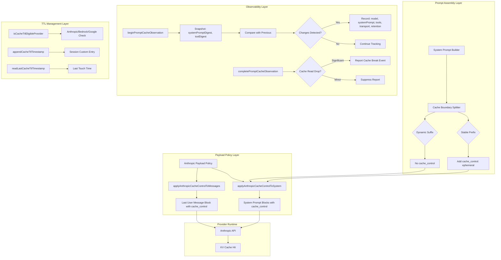
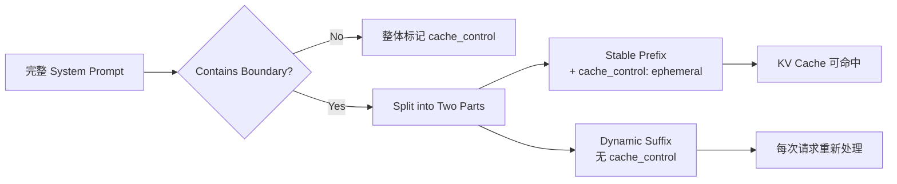
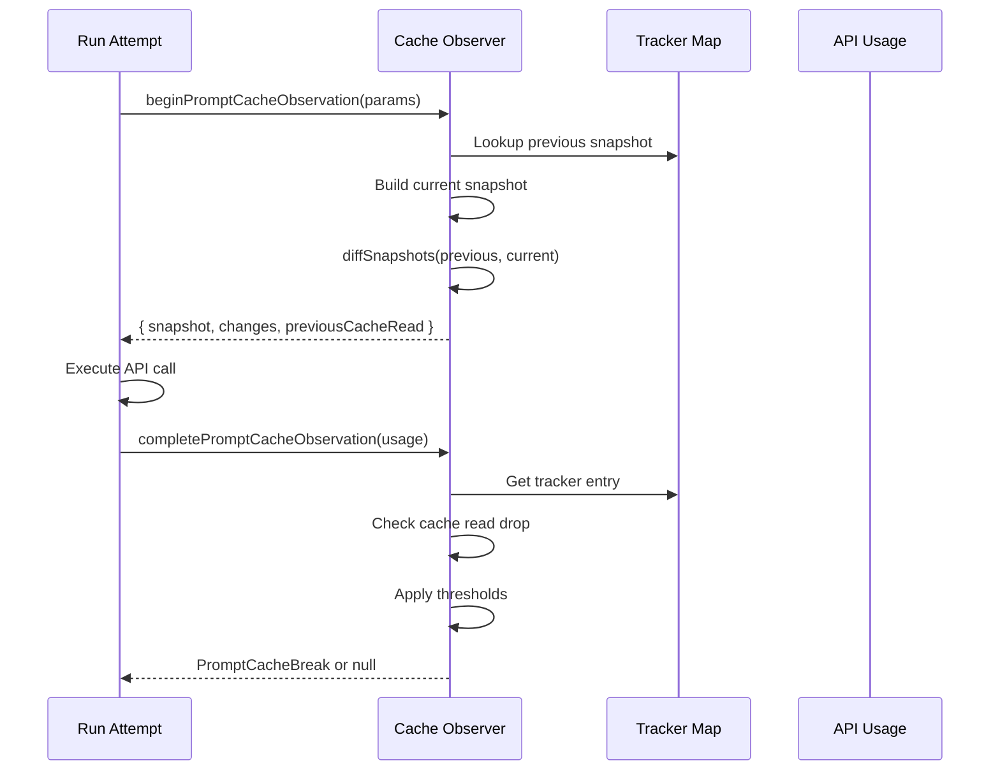
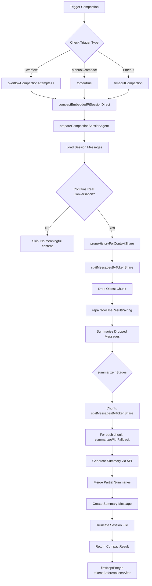
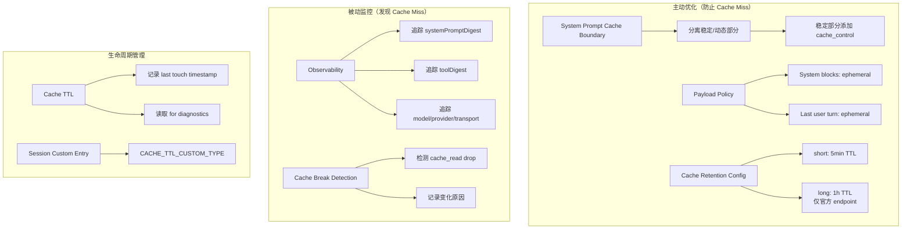

# OpenClaw 上下文压缩与 KV Cache 优化分析

> 本文档深入分析 OpenClaw 的上下文压缩机制，特别是针对推理引擎 KV Cache 命中率的优化策略。

---

## 一、核心发现：OpenClaw 有 KV Cache 优化

**结论：OpenClaw 确实有针对推理引擎 KV Cache 命中的优化机制。**

主要优化策略包括：

1. **System Prompt Cache Boundary 分割** - 分离稳定部分和动态部分
2. **Anthropic `cache_control: { type: "ephemeral" }` 标记** - 利用 Anthropic 的 Prompt Cache API
3. **Prompt Cache Observability 监控系统** - 追踪 cache 命中率和变化原因
4. **Cache TTL 管理** - 记录和追踪 cache 时间戳，避免不必要的 cache 失效
5. **Provider 级别的 Cache Eligibility 检测** - 自动判断哪些 provider/model 支持 cache

---

## 二、Prompt Cache 优化架构

### 2.1 整体架构图



### 2.2 核心组件说明

| 组件 | 文件位置 | 功能 |
|------|----------|------|
| Cache Boundary | [src/agents/system-prompt-cache-boundary.ts](src/agents/system-prompt-cache-boundary.ts) | 分割稳定/动态 prompt 部分 |
| Payload Policy | [src/agents/anthropic-payload-policy.ts](src/agents/anthropic-payload-policy.ts) | 应用 cache_control 标记 |
| Cache Observability | [src/agents/pi-embedded-runner/prompt-cache-observability.ts](src/agents/pi-embedded-runner/prompt-cache-observability.ts) | 监控 cache 命中情况 |
| Cache TTL | [src/agents/pi-embedded-runner/cache-ttl.ts](src/agents/pi-embedded-runner/cache-ttl.ts) | 管理 cache 生命周期 |
| Cache Retention | [src/agents/pi-embedded-runner/prompt-cache-retention.ts](src/agents/pi-embedded-runner/prompt-cache-retention.ts) | 解析 retention 配置 |
| Anthropic Family Semantics | [src/agents/pi-embedded-runner/anthropic-family-cache-semantics.ts](src/agents/pi-embedded-runner/anthropic-family-cache-semantics.ts) | 判断 Anthropic 系 provider |

---

## 三、System Prompt Cache Boundary 机制

### 3.1 Cache Boundary 标记

**文件**: [src/agents/system-prompt-cache-boundary.ts](src/agents/system-prompt-cache-boundary.ts)

```typescript
export const SYSTEM_PROMPT_CACHE_BOUNDARY = "\n<!-- OPENCLAW_CACHE_BOUNDARY -->\n";

export function splitSystemPromptCacheBoundary(
  text: string,
): { stablePrefix: string; dynamicSuffix: string } | undefined {
  const boundaryIndex = text.indexOf(SYSTEM_PROMPT_CACHE_BOUNDARY);
  if (boundaryIndex === -1) {
    return undefined;  // 无边界，整体可缓存
  }
  return {
    stablePrefix: text.slice(0, boundaryIndex).trimEnd(),    // 可缓存部分
    dynamicSuffix: text.slice(boundaryIndex + SYSTEM_PROMPT_CACHE_BOUNDARY.length).trimStart(), // 动态部分
  };
}
```

### 3.2 分割策略



### 3.3 动态部分示例

动态部分通常包含：
- 当前时间戳
- 用户特定信息
- 会话特定状态
- 临时指令/警告

稳定部分通常包含：
- Agent 角色定义
- 工具说明
- 通用规则
- 系统级配置

---

## 四、Anthropic Payload Policy 实现

### 4.1 cache_control 标记类型

**文件**: [src/agents/anthropic-payload-policy.ts](src/agents/anthropic-payload-policy.ts)

```typescript
export type AnthropicEphemeralCacheControl = {
  type: "ephemeral";
  ttl?: "1h";  // 长期缓存（仅限特定endpoint）
};
```

### 4.2 应用 cache_control 的位置

#### 4.2.1 System Prompt Blocks

```typescript
function applyAnthropicCacheControlToSystem(
  system: unknown,
  cacheControl: AnthropicEphemeralCacheControl,
): void {
  if (!Array.isArray(system)) return;

  for (const block of system) {
    const record = block as Record<string, unknown>;
    if (record.type !== "text") continue;

    const split = splitSystemPromptCacheBoundary(record.text);
    if (!split) {
      // 无边界：整体标记 cache_control
      if (record.cache_control === undefined) {
        record.cache_control = cacheControl;
      }
    } else {
      // 有边界：分割处理
      if (split.stablePrefix) {
        // 稳定部分添加 cache_control
        normalizedBlocks.push({
          ...rest,
          text: split.stablePrefix,
          cache_control: existingCacheControl ?? cacheControl,
        });
      }
      if (split.dynamicSuffix) {
        // 动态部分不添加 cache_control
        normalizedBlocks.push({
          ...rest,
          text: split.dynamicSuffix,
        });
      }
    }
  }
}
```

#### 4.2.2 Messages (Last User Turn)

```typescript
function applyAnthropicCacheControlToMessages(
  messages: unknown,
  cacheControl: AnthropicEphemeralCacheControl,
): void {
  if (!Array.isArray(messages) || messages.length === 0) return;

  const lastMessage = messages[messages.length - 1];
  if (lastMessage.role !== "user") return;

  // 只在最后一个 user turn 的最后一个 block 添加 cache_control
  // 这样可以保留 Anthropic cache-write scope
  const lastBlock = content[content.length - 1];
  if (lastBlockRecord.type === "text" || 
      lastBlockRecord.type === "image" || 
      lastBlockRecord.type === "tool_result") {
    lastBlockRecord.cache_control = cacheControl;
  }
}
```

### 4.3 Long TTL Eligibility

```typescript
function isLongTtlEligibleEndpoint(baseUrl: string | undefined): boolean {
  if (typeof baseUrl !== "string") return false;
  const hostname = resolveBaseUrlHostname(baseUrl);
  if (!hostname) return false;

  // 只有这些官方 endpoint 支持 1h TTL
  return (
    hostname === "api.anthropic.com" ||
    hostname === "aiplatform.googleapis.com" ||
    hostname.endsWith("-aiplatform.googleapis.com")
  );
}
```

---

## 五、Prompt Cache Observability 监控系统

### 5.1 监控架构

**文件**: [src/agents/pi-embedded-runner/prompt-cache-observability.ts](src/agents/pi-embedded-runner/prompt-cache-observability.ts)



### 5.2 监控的 Key Factors

```typescript
export type PromptCacheSnapshot = {
  provider: string;
  modelId: string;
  modelApi?: string | null;
  cacheRetention?: "none" | "short" | "long";
  streamStrategy: string;
  transport?: string;
  systemPromptDigest: string;  // SHA256 hash
  toolDigest: string;          // SHA256 hash (sorted tool names)
  toolCount: number;
  toolNames: string[];
};
```

### 5.3 变化检测代码

```typescript
function diffSnapshots(
  previous: PromptCacheSnapshot,
  next: PromptCacheSnapshot,
): PromptCacheChange[] | null {
  const changes: PromptCacheChange[] = [];

  // Model 变化
  if (previous.provider !== next.provider || previous.modelId !== next.modelId) {
    changes.push({
      code: "model",
      detail: `${previous.provider}/${previous.modelId} -> ${next.provider}/${next.modelId}`,
    });
  }

  // Cache Retention 变化
  if (previous.cacheRetention !== next.cacheRetention) {
    changes.push({
      code: "cacheRetention",
      detail: `${previous.cacheRetention ?? "default"} -> ${next.cacheRetention ?? "default"}`,
    });
  }

  // Transport 变化
  if (previous.transport !== next.transport) {
    changes.push({
      code: "transport",
      detail: `${previous.transport ?? "default"} -> ${next.transport ?? "default"}`,
    });
  }

  // Stream Strategy 变化
  if (previous.streamStrategy !== next.streamStrategy) {
    changes.push({
      code: "streamStrategy",
      detail: `${previous.streamStrategy} -> ${next.streamStrategy}`,
    });
  }

  // System Prompt 变化
  if (previous.systemPromptDigest !== next.systemPromptDigest) {
    changes.push({
      code: "systemPrompt",
      detail: "system prompt digest changed",
    });
  }

  // Tool Set 变化
  if (previous.toolDigest !== next.toolDigest) {
    changes.push({
      code: "tools",
      detail: previous.toolCount === next.toolCount
        ? "tool set changed with same count"
        : `${previous.toolCount} -> ${next.toolCount} tools`,
    });
  }

  return changes.length > 0 ? changes : null;
}
```

### 5.4 Cache Break 检测阈值

```typescript
const MIN_CACHE_BREAK_TOKEN_DROP = 1_000;       // 最小下降量
const MAX_STABLE_CACHE_READ_RATIO = 0.95;      // 稳定性阈值（95%）

const hasMeaningfulDrop =
  cacheRead < previousCacheRead * MAX_STABLE_CACHE_READ_RATIO &&
  tokenDrop >= MIN_CACHE_BREAK_TOKEN_DROP;
```

**说明**:
- Cache Read 下降 < 5% 或 < 1000 tokens 时，不报告 cache break
- 这可以过滤掉正常的测量波动

---

## 六、Cache TTL 管理

### 6.1 Provider Eligibility 判断

**文件**: [src/agents/pi-embedded-runner/cache-ttl.ts](src/agents/pi-embedded-runner/cache-ttl.ts)

```typescript
export function isCacheTtlEligibleProvider(
  provider: string,
  modelId: string,
  modelApi?: string,
): boolean {
  const normalizedProvider = normalizeLowercaseStringOrEmpty(provider);
  const normalizedModelId = normalizeLowercaseStringOrEmpty(modelId);

  // 1. 检查 Plugin 覆盖
  const pluginEligibility = resolveProviderCacheTtlEligibility({
    provider: normalizedProvider,
    context: { provider, modelId, modelApi },
  });
  if (pluginEligibility !== undefined) {
    return pluginEligibility;
  }

  // 2. 内置规则
  return (
    // Anthropic 直连
    isAnthropicFamilyCacheTtlEligible({ provider, modelId, modelApi }) ||
    // Kilocode 使用 Anthropic model ref
    (normalizedProvider === "kilocode" && isAnthropicModelRef(normalizedModelId)) ||
    // Google Gemini 2.5/3
    isGooglePromptCacheEligible({ modelApi, modelId })
  );
}
```

### 6.2 Cache TTL 时间戳记录

```typescript
export const CACHE_TTL_CUSTOM_TYPE = "openclaw.cache-ttl";

export type CacheTtlEntryData = {
  timestamp: number;
  provider?: string;
  modelId?: string;
};

export function readLastCacheTtlTimestamp(
  sessionManager: unknown,
  context?: CacheTtlContext,
): number | null {
  // 从 session custom entries 中读取最后一个 cache TTL 时间戳
  const entries = sm.getEntries();
  for (let i = entries.length - 1; i >= 0; i--) {
    const entry = entries[i];
    if (entry?.type !== "custom" || entry?.customType !== CACHE_TTL_CUSTOM_TYPE) {
      continue;
    }
    // 匹配 provider/modelId context
    const data = entry?.data as Partial<CacheTtlEntryData>;
    if (!matchesCacheTtlContext(data, context)) continue;
    
    const ts = data?.timestamp;
    if (ts && Number.isFinite(ts)) return ts;
  }
  return null;
}

export function appendCacheTtlTimestamp(
  sessionManager: unknown,
  data: CacheTtlEntryData
): void {
  sm.appendCustomEntry(CACHE_TTL_CUSTOM_TYPE, data);
}
```

---

## 七、上下文压缩机制分析

### 7.1 压缩核心流程

**文件**: [src/agents/compaction.ts](src/agents/compaction.ts)



### 7.2 核心压缩算法

#### 7.2.1 Token 估算

```typescript
export const SAFETY_MARGIN = 1.2; // 20% buffer for estimateTokens() inaccuracy

export function estimateMessagesTokens(messages: AgentMessage[]): number {
  // SECURITY: strip toolResult.details (可能包含敏感/大 payload)
  const safe = stripToolResultDetails(messages);
  return safe.reduce((sum, message) => sum + estimateTokens(message), 0);
}

function estimateCompactionMessageTokens(message: AgentMessage): number {
  return estimateMessagesTokens([message]);
}
```

#### 7.2.2 分块策略

```typescript
export const BASE_CHUNK_RATIO = 0.4;   // 基础分块比例
export const MIN_CHUNK_RATIO = 0.15;   // 最小分块比例

export function splitMessagesByTokenShare(
  messages: AgentMessage[],
  parts = 2,  // DEFAULT_PARTS
): AgentMessage[][] {
  const totalTokens = estimateMessagesTokens(messages);
  const targetTokens = totalTokens / parts;

  const chunks: AgentMessage[][] = [];
  let current: AgentMessage[] = [];
  let currentTokens = 0;

  // 关键：处理 tool_use/tool_result 配对
  let pendingToolCallIds = new Set<string>();
  let pendingChunkStartIndex: number | null = null;

  for (const message of messages) {
    // 累积 token 直到超出目标
    if (currentTokens + messageTokens > targetTokens) {
      chunks.push(current);
      current = [];
      currentTokens = 0;
    }

    current.push(message);

    // 处理 assistant message 的 tool calls
    if (message.role === "assistant") {
      const toolCalls = extractToolCallsFromAssistant(message);
      pendingToolCallIds = new Set(toolCalls.map(t => t.id));
      pendingChunkStartIndex = current.length - 1;
    }

    // 处理 toolResult，清理 pending IDs
    if (message.role === "toolResult" && pendingToolCallIds.size > 0) {
      pendingToolCallIds.delete(extractToolResultId(message));
      // 当所有 tool calls 都收到 result 后，检查是否可以分割
      if (pendingToolCallIds.size === 0 && currentTokens > targetTokens) {
        splitCurrentAtPendingBoundary();
      }
    }
  }

  return chunks;
}
```

#### 7.2.3 历史裁剪

```typescript
export function pruneHistoryForContextShare(params: {
  messages: AgentMessage[];
  maxContextTokens: number;
  maxHistoryShare?: number;  // 默认 0.5
  parts?: number;
}): {
  messages: AgentMessage[];  // 保留的消息
  droppedMessagesList: AgentMessage[];  // 被裁剪的消息
  droppedChunks: number;
  droppedMessages: number;
  droppedTokens: number;
  keptTokens: number;
  budgetTokens: number;
} {
  const maxHistoryShare = params.maxHistoryShare ?? 0.5;
  const budgetTokens = Math.floor(params.maxContextTokens * maxHistoryShare);

  let keptMessages = params.messages;
  const allDroppedMessages: AgentMessage[] = [];

  while (keptMessages.length > 0 && estimateMessagesTokens(keptMessages) > budgetTokens) {
    const chunks = splitMessagesByTokenShare(keptMessages, parts);
    if (chunks.length <= 1) break;  // 无法再分割

    const [dropped, ...rest] = chunks;
    const flatRest = rest.flat();

    // 关键：修复 orphaned tool_results
    const repairReport = repairToolUseResultPairing(flatRest);
    const repairedKept = repairReport.messages;

    // orphaned tool_results 也计入 dropped
    droppedMessages += dropped.length + repairReport.droppedOrphanCount;

    allDroppedMessages.push(...dropped);
    keptMessages = repairedKept;
  }

  return {
    messages: keptMessages,
    droppedMessagesList: allDroppedMessages,
    // ...其他统计
  };
}
```

#### 7.2.4 多阶段摘要

```typescript
export async function summarizeInStages(params: {
  messages: AgentMessage[];
  model: ProviderRuntimeModel;
  apiKey: string;
  signal: AbortSignal;
  reserveTokens: number;
  maxChunkTokens: number;
  contextWindow: number;
  previousSummary?: string;
  parts?: number;
}): Promise<string> {
  const minMessagesForSplit = 4;
  const totalTokens = estimateMessagesTokens(messages);

  // 条件：是否需要分阶段摘要
  if (parts <= 1 || messages.length < minMessagesForSplit || totalTokens <= maxChunkTokens) {
    return summarizeWithFallback(params);  // 直接摘要
  }

  // 分阶段摘要
  const splits = splitMessagesByTokenShare(messages, parts);
  const partialSummaries: string[] = [];

  for (const chunk of splits) {
    partialSummaries.push(
      await summarizeWithFallback({ ...params, messages: chunk })
    );
  }

  // 合并 partial summaries
  const summaryMessages = partialSummaries.map(summary => ({
    role: "user",
    content: summary,
    timestamp: Date.now(),
  }));

  const MERGE_SUMMARIES_INSTRUCTIONS = [
    "Merge these partial summaries into a single cohesive summary.",
    "MUST PRESERVE:",
    "- Active tasks and current status",
    "- Batch operation progress",
    "- Last user request and what was being done",
    "- Decisions and rationale",
    "- TODOs, open questions, constraints",
    "PRIORITIZE recent context over older history.",
  ];

  return summarizeWithFallback({
    ...params,
    messages: summaryMessages,
    customInstructions: MERGE_SUMMARIES_INSTRUCTIONS,
  });
}
```

### 7.3 压缩与 KV Cache 的关系

**关键发现：OpenClaw 的压缩机制本身不直接优化 KV Cache 命中率。**

但是，压缩后的 context 会影响下一次请求的 cache 命中：

| 压缩操作 | 对 KV Cache 的影响 |
|----------|---------------------|
| 保留 recent turns | ✅ 有利于 cache 命中（recent 内容可能已 cached） |
| 生成 summary | ⚠️ 新内容，无 cache |
| Tool result repair | ⚠️ 可能改变 message structure |
| `firstKeptEntryId` | 📍 记录裁剪边界，但不用于 cache 管理 |

**实际的 KV Cache 保护主要通过 Prompt Cache 机制实现，而非压缩策略。**

---

## 八、KV Cache 优化策略总结

### 8.1 OpenClaw 的 KV Cache 优化策略



### 8.2 优化策略详解

| 策略 | 实现方式 | 效果 |
|------|----------|------|
| **System Prompt 分割** | `<!-- OPENCLAW_CACHE_BOUNDARY -->` | 稳定部分可 cache，动态部分每次 fresh |
| **Ephemeral Cache Mark** | `cache_control: { type: "ephemeral" }` | Anthropic API 自动缓存，5min/1h TTL |
| **Tool Set Stability** | SHA256(sorted toolNames) | Tool 顺序变化不影响 cache（set 比较） |
| **Observability Tracking** | Tracker Map (max 512 entries) | 发现 cache break 原因 |
| **Provider Eligibility** | Anthropic/Bedrock/Google 自动检测 | 只对支持的 provider 应用 cache 策略 |

### 8.3 不优化的场景

| 场景 | 原因 |
|------|------|
| **压缩后的摘要内容** | 摘要是新生成的内容，无 cache |
| **Tool result 细节变化** | 即使 stripped details，structure 可能变化 |
| **频繁 model/provider 切换** | Cache 按 model-provider 绑定 |
| **Non-Anthropic providers** | 大多数不支持 prompt cache API |

---

## 九、配置参考

### 9.1 Cache Retention 配置

```json5
// openclaw.json
{
  agents: {
    defaults: {
      models: {
        "anthropic/claude-sonnet-4-6": {
          params: {
            cacheRetention: "long",  // 使用 1h TTL
          },
        },
      },
    },
  },
}
```

### 9.2 Compaction 配置

```json5
{
  agents: {
    defaults: {
      compaction: {
        mode: "default",           // 或 "safeguard"
        maxHistoryShare: 0.5,      // 最多保留 50% context 给 history
        reserveTokens: 8192,       // 为 reply/tool 预留 tokens
        keepRecentTokens: 4096,    // 保护最近的 tokens
        identifierPolicy: "strict", // 保持 opaque identifiers
      },
    },
  },
}
```

---

## 十、相关文件索引

### 10.1 KV Cache 相关

| 文件 | 功能 |
|------|------|
| [src/agents/system-prompt-cache-boundary.ts](src/agents/system-prompt-cache-boundary.ts) | Cache 边界分割 |
| [src/agents/anthropic-payload-policy.ts](src/agents/anthropic-payload-policy.ts) | Anthropic cache_control 应用 |
| [src/agents/prompt-cache-stability.ts](src/agents/prompt-cache-stability.ts) | Prompt 稳定性处理 |
| [src/agents/pi-embedded-runner/prompt-cache-observability.ts](src/agents/pi-embedded-runner/prompt-cache-observability.ts) | Cache 监控 |
| [src/agents/pi-embedded-runner/cache-ttl.ts](src/agents/pi-embedded-runner/cache-ttl.ts) | TTL 管理 |
| [src/agents/pi-embedded-runner/prompt-cache-retention.ts](src/agents/pi-embedded-runner/prompt-cache-retention.ts) | Retention 解析 |
| [src/agents/pi-embedded-runner/anthropic-family-cache-semantics.ts](src/agents/pi-embedded-runner/anthropic-family-cache-semantics.ts) | Anthropic 系判断 |

### 10.2 压缩相关

| 文件 | 功能 |
|------|------|
| [src/agents/compaction.ts](src/agents/compaction.ts) | 核心压缩算法 |
| [src/agents/pi-embedded-runner/compact.ts](src/agents/pi-embedded-runner/compact.ts) | 主压缩实现 |
| [src/agents/pi-embedded-runner/run/preemptive-compaction.ts](src/agents/pi-embedded-runner/run/preemptive-compaction.ts) | 预防性压缩 |
| [src/agents/pi-embedded-runner/context-engine-maintenance.ts](src/agents/pi-embedded-runner/context-engine-maintenance.ts) | Engine 维护 |
| [src/agents/session-transcript-repair.ts](src/agents/session-transcript-repair.ts) | Transcript 修复 |

---

## 十一、总结

### 11.1 KV Cache 优化要点

OpenClaw **有** KV Cache 优化，主要体现在：

1. ✅ **System Prompt Cache Boundary** - 分离可缓存部分
2. ✅ **Anthropic Prompt Cache API** - 使用 `cache_control: ephemeral`
3. ✅ **Observability System** - 监控 cache 命中变化
4. ✅ **Provider Eligibility** - 自动判断支持的 provider
5. ✅ **TTL Management** - 记录 cache 生命周期

### 11.2 压缩与 Cache 的关系

| 维度 | 关系 |
|------|------|
| 压缩算法本身 | ❌ 不直接优化 KV Cache |
| 压缩后的 context | ⚠️ 影响下一次请求的 cache 命中 |
| Summary 生成 | ❌ 新内容，无法 cache |
| Recent turns 保留 | ✅ 可能已有 cache |

### 11.3 最佳实践建议

1. **使用支持的 Provider** - Anthropic/Bedrock/Google Gemini 2.5+
2. **配置 long cacheRetention** - 对于官方 endpoint，使用 1h TTL
3. **保持 System Prompt 稳定** - 将动态部分放在 boundary 后
4. **监控 Cache Break** - 通过 observability 发现 cache 失效原因
5. **避免频繁切换** - Model/Provider/Transport 变化会导致 cache 失效