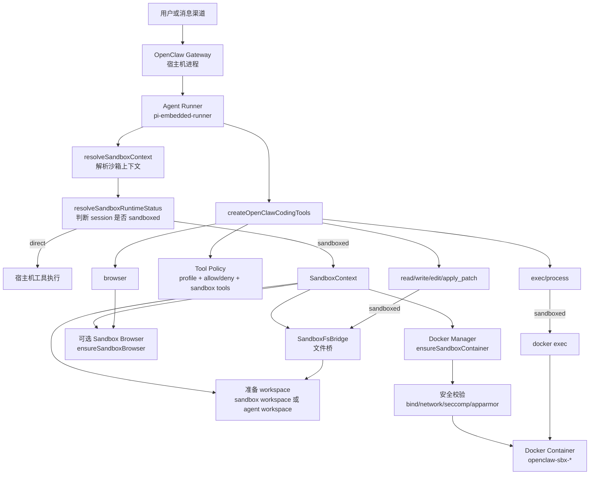
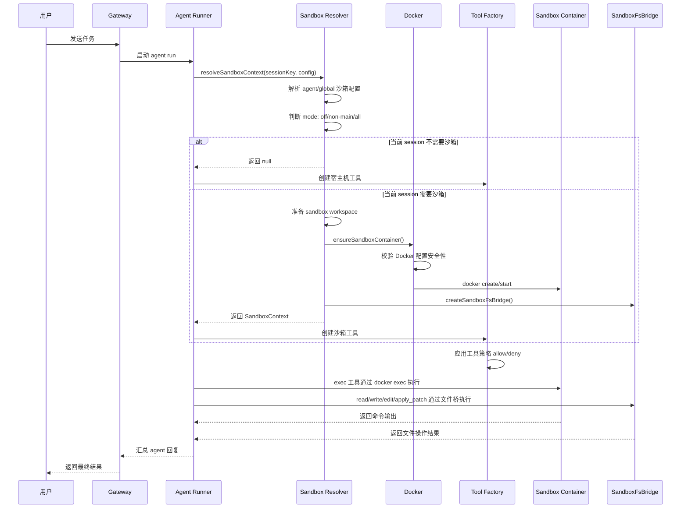

# OpenClaw 沙箱架构分析报告

## 1. 总览

OpenClaw 的沙箱不是把整个 Gateway 进程放进容器里运行，而是一个“工具执行沙箱”。Gateway 仍然运行在宿主机上，负责接收消息、调度 agent、管理配置和维护会话；当某个 agent session 被判定需要沙箱化时，OpenClaw 会为该 session、agent 或共享作用域准备 Docker 容器，然后把工具调用路由到容器或受控文件桥中执行。

也就是说，沙箱保护的重点是模型可调用的工具，例如 `exec`、`read`、`write`、`edit`、`apply_patch` 和可选的 browser 工具。它的目标是降低模型误操作时的破坏半径，而不是提供绝对安全边界。

核心入口位于：

- `src/agents/pi-embedded-runner/run/attempt.ts`: 每次 agent run 会解析沙箱上下文。
- `src/agents/sandbox/context.ts`: 负责生成 `SandboxContext`。
- `src/agents/sandbox/docker.ts`: 负责 Docker 容器创建、复用和配置哈希管理。
- `src/agents/pi-tools.ts`: 根据是否存在沙箱上下文组装工具。
- `src/agents/bash-tools.exec.ts` 和 `src/agents/bash-tools.exec-runtime.ts`: 负责 `exec` 工具的宿主机、节点或沙箱执行。
- `src/agents/sandbox/fs-bridge.ts`: 负责沙箱文件工具的路径解析和安全读写。

## 2. 核心设计

OpenClaw 沙箱可以理解为三层控制：

1. Sandbox runtime：决定工具在哪里运行，是宿主机还是 Docker 容器。
2. Tool policy：决定哪些工具可以被模型调用。
3. Elevated exec：为 `exec` 提供一个显式的宿主机逃生口，但需要配置和权限门禁。

这三者彼此独立。沙箱不会自动允许被 tool policy 禁止的工具；elevated 也不会绕过工具 allow/deny，只会在允许的情况下让 `exec` 从沙箱切回宿主机执行。

## 3. 配置模型

沙箱配置主要来自 `agents.defaults.sandbox` 和 `agents.list[].sandbox`。全局配置提供默认行为，单个 agent 可以覆盖部分配置。

关键字段如下：

| 字段 | 含义 |
| --- | --- |
| `mode` | 控制何时启用沙箱，可选 `off`、`non-main`、`all`。 |
| `scope` | 控制容器粒度，可选 `session`、`agent`、`shared`。 |
| `workspaceAccess` | 控制真实 agent workspace 的可见性，可选 `none`、`ro`、`rw`。 |
| `workspaceRoot` | 沙箱 workspace 的宿主机根目录，默认在 OpenClaw state 目录下的 `sandboxes`。 |
| `docker` | Docker 镜像、网络、只读 rootfs、tmpfs、capabilities、资源限制、bind mounts 等。 |
| `browser` | 可选的沙箱浏览器容器配置。 |
| `tools` | 沙箱状态下额外生效的工具 allow/deny 策略。 |
| `prune` | 空闲或过旧容器的清理策略。 |

`mode` 的语义：

- `off`: 不启用沙箱，工具直接在宿主机运行。
- `non-main`: 只有非 main session 进入沙箱，群聊或频道 session 通常会被视为非 main。
- `all`: 所有 session 都进入沙箱。

`scope` 的语义：

- `session`: 每个 session 一个容器。
- `agent`: 每个 agent 一个容器。
- `shared`: 所有沙箱 session 共用一个容器。

`workspaceAccess` 的语义：

- `none`: 工具看到的是沙箱 workspace，不直接挂载真实 agent workspace。
- `ro`: 真实 agent workspace 以只读方式挂载到容器的 `/agent`。
- `rw`: 真实 agent workspace 作为主要 workspace，以读写方式挂载到容器的 `/workspace`。

## 4. 架构图



## 5. 任务执行流程

一次沙箱化任务的大致流程如下：



## 6. Docker 容器如何创建

沙箱容器创建时，OpenClaw 会生成 Docker create 参数，并附加一组安全默认值：

- 默认镜像：`openclaw-sandbox:bookworm-slim`。
- 默认工作目录：`/workspace`。
- 默认网络：`none`。
- 默认只读 root filesystem：`--read-only`。
- 默认 tmpfs：`/tmp`、`/var/tmp`、`/run`。
- 默认 capability drop：`--cap-drop ALL`。
- 默认安全选项：`--security-opt no-new-privileges`。
- 可配置资源限制：PID、memory、memorySwap、CPU、ulimit。
- 可配置 seccomp 和 AppArmor profile。
- 容器会带有 OpenClaw labels，用于识别 session、创建时间和配置哈希。

OpenClaw 会计算沙箱配置哈希。如果现有容器的哈希和当前配置不一致，且容器不是刚刚热使用的容器，OpenClaw 会移除旧容器并重建；如果刚被使用，则提示用户通过 `openclaw sandbox recreate` 显式重建。

## 7. 挂载和 workspace 访问

容器中的 workspace 访问由 `workspaceAccess` 控制。

当 `workspaceAccess = none`：

- 容器主要看到沙箱 workspace。
- 真实 agent workspace 不会作为 `/agent` 挂进去。
- 适合高隔离任务。

当 `workspaceAccess = ro`：

- 沙箱 workspace 挂到 `/workspace`。
- 真实 agent workspace 只读挂到 `/agent`。
- `write`、`edit`、`apply_patch` 会受到限制，不能修改真实 workspace。

当 `workspaceAccess = rw`：

- 真实 agent workspace 作为主要 workspace 挂到 `/workspace`。
- 文件工具可以写入真实 workspace。
- 适合可信任务或需要实际修改代码的 agent。

自定义 bind mounts 会额外暴露宿主机路径。OpenClaw 会阻止危险 bind，例如系统目录、Docker socket、`/proc`、`/sys`、`/dev` 等。bind mounts 是沙箱的重要逃逸风险点，因此默认应优先使用只读挂载。

## 8. 文件工具如何工作

沙箱下的文件工具不是简单地在宿主机上 `fs.readFile` 或 `fs.writeFile`。OpenClaw 会创建 `SandboxFsBridge`，用它实现受控的文件操作。

文件桥主要做几件事：

1. 根据输入路径判断它对应容器路径还是宿主机路径。
2. 将容器路径映射回允许的宿主机 mount root。
3. 检查路径是否逃出沙箱 root。
4. 检查该 mount 是否可写。
5. 对写入、重命名、删除等操作做二次路径安全校验。

例如模型要求读取 `/workspace/src/index.ts`，文件桥会识别 `/workspace` 对应的宿主机 mount root，然后读取实际文件。模型要求写 `/etc/passwd` 时，因为该路径不在允许的 mount 内，会被拒绝。

## 9. exec 工具如何工作

`exec` 工具有三种执行 host：

- `sandbox`: 在 Docker 沙箱容器里执行。
- `gateway`: 在 Gateway 所在宿主机执行。
- `node`: 在配置的远程 node 上执行。

当当前 session 有 `SandboxContext` 且 `exec` host 是 `sandbox` 时，命令不会直接在宿主机 shell 中运行，而是被包装成 `docker exec`：

```text
docker exec -i <container> sh -lc "<command>"
```

执行时会使用容器内的工作目录，例如 `/workspace`。系统提示也会提醒模型：文件工具看到的是宿主机挂载源路径，而 `exec` 命令应该使用容器路径或相对路径。

如果用户或模型请求 elevated，并且配置允许，`exec` 可以从 `sandbox` 切到 `gateway`，也就是回到宿主机执行。但 elevated 只作用于 `exec`，且仍受工具策略、来源 allowlist 和审批策略控制。

## 10. 工具策略

沙箱状态下，OpenClaw 会额外应用 `tools.sandbox.tools.allow` 和 `tools.sandbox.tools.deny`。默认允许常见编码工具，例如：

- `exec`
- `process`
- `read`
- `write`
- `edit`
- `apply_patch`
- `image`
- session/subagent 相关工具

默认拒绝更敏感或更容易跨边界的工具，例如：

- `browser`
- `canvas`
- `nodes`
- `cron`
- `gateway`
- 各消息渠道工具

规则是：

- `deny` 优先级最高。
- 如果 `allow` 非空，未列入 allow 的工具会被视为不可用。
- 沙箱不会恢复被全局 tool policy 禁止的工具。
- `/exec` 只能调整 session 的 exec 默认行为，不能绕过 tool policy。

## 11. 沙箱浏览器

沙箱浏览器是可选能力。启用后，OpenClaw 会单独创建 browser container，并通过 CDP bridge 和可选 noVNC observer URL 让工具访问浏览器。

默认浏览器容器会使用独立 Docker network，而不是全局 `bridge` 网络。noVNC observer 默认带短期 token，密码放在 URL fragment 中，避免出现在 query/header 日志里。配置也可以限制 CDP ingress 来源、是否允许控制宿主机浏览器，以及哪些 custom browser URL、host、port 可以被控制。

## 12. 安全边界和限制

OpenClaw 沙箱能显著降低误操作影响，但不是完美安全边界。原因包括：

- Docker 本身不是绝对安全沙箱。
- 自定义 bind mounts 可能暴露宿主机敏感路径。
- `workspaceAccess = rw` 会允许修改真实 workspace。
- elevated exec 是显式逃生口。
- 如果配置允许网络，容器可能访问外部资源。
- 如果配置加入其他容器网络 namespace，会弱化隔离，因此默认阻止。

因此推荐默认策略是：

- 普通聊天或可信主 session 可以 direct。
- 群聊、频道、自动化任务使用 `non-main` 或 `all`。
- 不需要改代码时使用 `workspaceAccess = none` 或 `ro`。
- 需要真实修改代码时再使用 `rw`。
- 自定义 bind 优先 `:ro`。
- 不要挂载 Docker socket、系统目录或密钥目录。
- elevated 只对可信来源开放。

## 13. 通俗示例

假设用户在群聊里说：

```text
帮我看看这个项目为什么测试失败，先运行 pnpm test
```

配置如下：

```jsonc
{
  "agents": {
    "defaults": {
      "sandbox": {
        "mode": "non-main",
        "scope": "session",
        "workspaceAccess": "ro"
      }
    }
  }
}
```

执行过程如下：

1. 群聊 session 不是 main session，所以 `non-main` 命中，任务进入沙箱。
2. OpenClaw 创建或复用一个 `openclaw-sbx-*` Docker 容器。
3. 沙箱 workspace 挂到容器的 `/workspace`。
4. 真实项目目录以只读方式挂到容器的 `/agent`。
5. 模型调用 `exec` 执行 `pnpm test` 时，实际执行位置是容器。
6. 如果测试脚本尝试写真实项目目录，因为是只读挂载，会失败。
7. 如果模型尝试读取文件，文件桥会允许读取挂载范围内的路径。
8. 如果模型尝试写 `/etc/passwd`、访问 Docker socket 或使用 host 网络，会被沙箱安全策略阻止。

这个过程就像给 agent 准备了一间临时实验室。Gateway 站在实验室外调度任务，agent 的命令和文件操作尽量在实验室里完成。实验室能不能看到真实项目、能不能写、有没有网络、能不能开浏览器，都由配置决定。只有显式允许 elevated 时，`exec` 才能临时离开实验室回到宿主机。

## 14. 调试命令

常用沙箱调试命令：

```bash
openclaw sandbox explain
openclaw sandbox explain --session agent:main:main
openclaw sandbox explain --agent work
openclaw sandbox explain --json
```

查看容器：

```bash
openclaw sandbox list
openclaw sandbox list --browser
openclaw sandbox list --json
```

配置或镜像变化后重建容器：

```bash
openclaw sandbox recreate --all
openclaw sandbox recreate --session main
openclaw sandbox recreate --agent mybot
openclaw sandbox recreate --browser
```

## 15. 相关文档

- [Sandboxing](/gateway/sandboxing)
- [Sandbox vs Tool Policy vs Elevated](/gateway/sandbox-vs-tool-policy-vs-elevated)
- [Sandbox CLI](/cli/sandbox)
- [Multi-Agent Sandbox and Tools](/tools/multi-agent-sandbox-tools)
