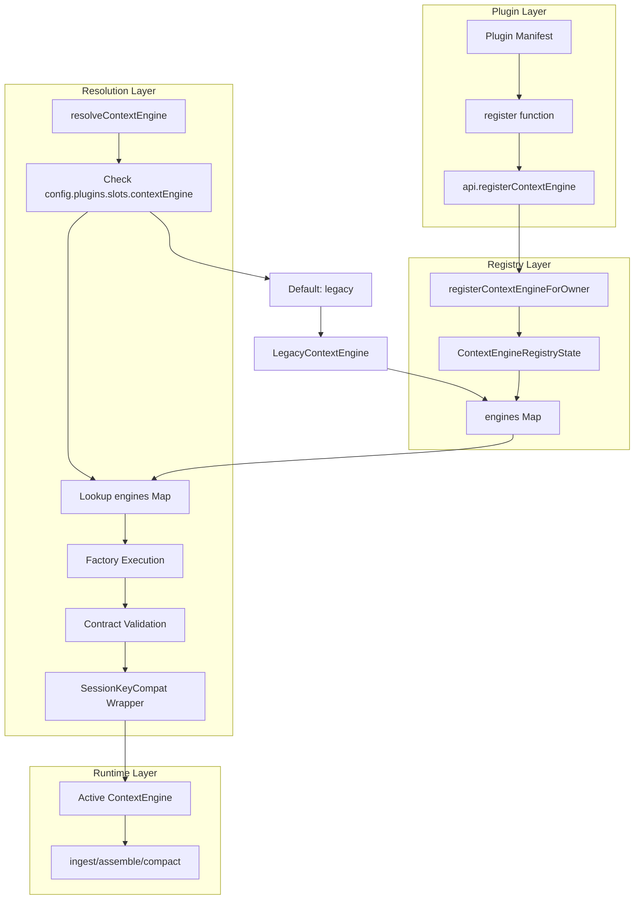
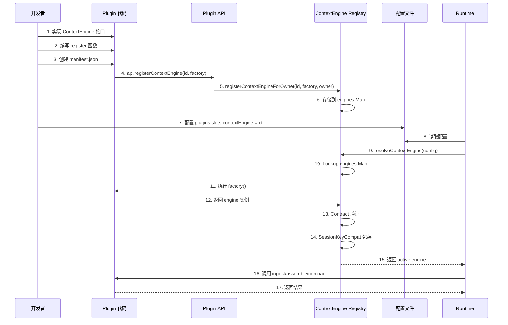

# OpenClaw 自定义 ContextEngine 集成机制详解

> 本文档详细分析 OpenClaw 的 ContextEngine 插件集成机制，包括架构设计、注册流程、Contract 验证规则、以及自定义实现指南。

---

## 一、集成架构总览

### 1.1 整体架构图



### 1.2 核心组件职责

| 组件 | 文件位置 | 职责说明 |
|------|----------|----------|
| Plugin API | [src/plugins/types.ts](src/plugins/types.ts) | 提供插件注册入口接口 |
| Plugin Registry | [src/plugins/registry.ts](src/plugins/registry.ts) | 管理插件级别的 engine 注册 |
| Context Engine Registry | [src/context-engine/registry.ts](src/context-engine/registry.ts) | 全局 engine 存储和解析 |
| Slot Selection | [src/plugins/slots.ts](src/plugins/slots.ts) | 配置槽位选择机制 |
| Engine Interface | [src/context-engine/types.ts](src/context-engine/types.ts) | ContextEngine 接口定义 |
| Legacy Engine | [src/context-engine/legacy.ts](src/context-engine/legacy.ts) | 默认内置引擎实现 |
| Delegate Helper | [src/context-engine/delegate.ts](src/context-engine/delegate.ts) | 压缩委托辅助函数 |

---

## 二、核心集成点详解

### 2.1 Plugin API 入口

**文件**: [src/plugins/types.ts:1968-1972](src/plugins/types.ts#L1968-L1972)

```typescript
export type OpenClawPluginApi = {
  /**
   * Register a context engine implementation (exclusive slot - only one active at a time).
   */
  registerContextEngine: (
    id: string,
    factory: import("../context-engine/registry.js").ContextEngineFactory,
  ) => void;

  // ... 其他方法
};
```

**说明**:
- `id`: Engine 的唯一标识符
- `factory`: 创建 engine 实例的工厂函数（支持异步）
- 独占槽位（exclusive slot）: 同一时间只有一个 engine 可被激活

### 2.2 Registry 核心注册逻辑

**文件**: [src/plugins/registry.ts:1199-1224](src/plugins/registry.ts#L1199-L1224)

```typescript
registerContextEngine: (id, factory) => {
  // Step 1: 防止覆盖 core 保留的 id（如 "legacy")
  if (id === defaultSlotIdForKey("contextEngine")) {
    pushDiagnostic({
      level: "error",
      pluginId: record.id,
      source: record.source,
      message: `context engine id reserved by core: ${id}`,
    });
    return;
  }

  // Step 2: 调用全局注册函数
  const result = registerContextEngineForOwner(
    id,
    factory,
    `plugin:${record.id}`,
    { allowSameOwnerRefresh: true }
  );

  // Step 3: 处理重复注册
  if (!result.ok) {
    pushDiagnostic({
      level: "error",
      pluginId: record.id,
      source: record.source,
      message: `context engine already registered: ${id} (${result.existingOwner})`,
    });
    return;
  }

  // Step 4: 记录到 plugin record
  if (!record.contextEngineIds?.includes(id)) {
    record.contextEngineIds = [...(record.contextEngineIds ?? []), id];
  }
}
```

**关键逻辑**:
1. **保留 ID 检查**: 不能注册 `"legacy"`（core 内置默认）
2. **Owner 标识**: 使用 `plugin:${record.id}` 标识注册来源
3. **重复注册保护**: 已被其他 owner 注册的 id 会报错
4. **同 Owner 刷新**: 允许同一插件刷新自己的注册

### 2.3 Slot 选择机制

**文件**: [src/plugins/slots.ts:17-20](src/plugins/slots.ts#L17-L20)

```typescript
const DEFAULT_SLOT_BY_KEY: Record<PluginSlotKey, string> = {
  memory: "memory-core",
  contextEngine: "legacy",  // 默认使用 legacy 引擎
};
```

**配置覆盖方式**:

```json5
// openclaw.json
{
  plugins: {
    slots: {
      contextEngine: "my-custom-engine",  // 覆盖默认值
    },
  },
}
```

### 2.4 Engine 解析流程

**文件**: [src/context-engine/registry.ts:457-523](src/context-engine/registry.ts#L457-L523)

```typescript
export async function resolveContextEngine(config?: OpenClawConfig): Promise<ContextEngine> {
  // Step 1: 从配置获取 slot 值
  const slotValue = config?.plugins?.slots?.contextEngine;
  const engineId = slotValue?.trim() || defaultSlotIdForKey("contextEngine");

  // Step 2: 查找注册的 engine
  const entry = getContextEngineRegistryState().engines.get(engineId);
  if (!entry) {
    // 非默认引擎未找到时 fallback 到 legacy
    if (engineId !== defaultEngineId) {
      console.error(`Context engine "${engineId}" not registered; fallback to default.`);
      return resolveDefaultContextEngine(defaultEngineId);
    }
    throw new Error(`Context engine "${engineId}" not registered.`);
  }

  // Step 3: 执行 factory 创建 engine 实例
  let engine: ContextEngine;
  try {
    engine = await entry.factory();
  } catch (factoryError) {
    // 非默认引擎 factory 失败时 fallback
    if (engineId !== defaultEngineId) {
      console.error(`Factory threw: ${factoryError.message}; fallback to default.`);
      return resolveDefaultContextEngine(defaultEngineId);
    }
    throw factoryError;
  }

  // Step 4: Contract 验证
  const contractError = describeResolvedContextEngineContractError(engineId, engine);
  if (contractError) {
    if (engineId !== defaultEngineId) {
      console.error(`${contractError}; fallback to default.`);
      return resolveDefaultContextEngine(defaultEngineId);
    }
    throw new Error(contractError);
  }

  // Step 5: 包装 sessionKey 兼容层
  return wrapContextEngineWithSessionKeyCompat(engine);
}
```

**解析策略**:
1. **配置优先**: 用户配置的 slot 值优先
2. **Fallback 机制**: 非 default engine 失败时自动 fallback
3. **Contract 验证**: 强制校验 engine 实现符合规范
4. **兼容层包装**: 处理旧版 sessionKey 参数兼容

---

## 三、Contract 验证规则

**文件**: [src/context-engine/registry.ts:399-439](src/context-engine/registry.ts#L399-L439)

### 3.1 必需成员验证

```typescript
function describeResolvedContextEngineContractError(
  engineId: string,
  engine: unknown
): string | null {
  const issues: string[] = [];

  // 1. 验证 info 对象
  const info = candidate.info;
  if (!info || typeof info !== "object") {
    issues.push("missing info");
  } else {
    // info.id 必须与注册 id 一致
    if (info.id !== engineId) {
      issues.push(`info.id must match "${engineId}"`);
    }
    // info.name 必须非空
    if (!info.name?.trim()) {
      issues.push("missing info.name");
    }
  }

  // 2. 验证必需方法
  if (typeof candidate.ingest !== "function") {
    issues.push("missing ingest()");
  }
  if (typeof candidate.assemble !== "function") {
    issues.push("missing assemble()");
  }
  if (typeof candidate.compact !== "function") {
    issues.push("missing compact()");
  }

  return issues.length === 0 ? null : `Invalid ContextEngine: ${issues.join(", ")}.`;
}
```

### 3.2 验证规则总结

| 验证项 | 规则 | 错误消息示例 |
|--------|------|--------------|
| `info` 存在 | 必须是对象 | `missing info` |
| `info.id` | 必须匹配注册 id | `info.id must match "my-engine"` |
| `info.name` | 必须非空字符串 | `missing info.name` |
| `ingest()` | 必须是函数 | `missing ingest()` |
| `assemble()` | 必须是函数 | `missing assemble()` |
| `compact()` | 必须是函数 | `missing compact()` |

---

## 四、实现自定义 ContextEngine 需要的功能

### 4.1 必需实现（Required）

| 方法 | 参数 | 返回值 | 功能说明 |
|------|------|--------|----------|
| `info` | - | `ContextEngineInfo` | 元数据：id、name、version、ownsCompaction |
| `ingest(params)` | sessionId, message, isHeartbeat | `IngestResult` | 消息摄入（存储/索引） |
| `assemble(params)` | sessionId, messages, tokenBudget, availableTools, model | `AssembleResult` | 上下文组装（在 token 预算内选择消息） |
| `compact(params)` | sessionId, tokenBudget, force, sessionFile | `CompactResult` | 上下文压缩（摘要/裁剪） |

### 4.2 可选实现（Optional）

| 方法 | 触发时机 | 功能说明 |
|------|----------|----------|
| `bootstrap(params)` | Engine 首次看到 session | 会话初始化（导入历史、初始化存储） |
| `ingestBatch(params)` | Turn 结束后 | 批量消息摄入（整批处理更高效） |
| `afterTurn(params)` | Run 完成后 | Turn 后生命周期（持久化、后台压缩触发） |
| `maintain(params)` | Bootstrap/Turn 后 | Transcript 维护（rewriteTranscriptEntries 调用） |
| `prepareSubagentSpawn(params)` | 子代理 spawn 前（未启用） | 子代理 spawn 前准备 |
| `onSubagentEnded(params)` | 子代理结束时 | 子代理结束清理 |
| `dispose()` | Gateway 关闭/Plugin reload | 资源释放 |

### 4.3 关键决策：ownsCompaction

```typescript
export type ContextEngineInfo = {
  id: string;
  name: string;
  version?: string;
  ownsCompaction?: boolean;  // 关键标志
  turnMaintenanceMode?: "foreground" | "background";
};
```

**`ownsCompaction` 含义**:

| 值 | 效果 | 适用场景 |
|----|------|----------|
| `true` | Engine 完全控制压缩，禁用 Pi 内置 auto-compaction | 自定义压缩算法、向量检索、DAG 摘要 |
| `false` 或不设置 | Engine 仍需实现 `compact()`，Pi 内置 auto-compaction 可运行 | 复用内置压缩逻辑，自定义其他行为 |

---

## 五、两种实现模式

### 5.1 模式 A：完全自控模式（Owning Mode）

**特点**:
- `ownsCompaction: true`
- 完全自定义 `compact()` 实现
- 禁用 Pi 内置 auto-compaction
- Engine 负责 `/compact`、overflow recovery、proactive compaction

**适用场景**:
- 需要语义压缩（向量检索）
- DAG 摘要（多层历史压缩）
- Provider 特定压缩策略
- 高级检索增强生成（RAG）

**示例代码**:

```typescript
export class CustomOwningEngine implements ContextEngine {
  readonly info: ContextEngineInfo = {
    id: "custom-owning",
    name: "Custom Owning Engine",
    ownsCompaction: true,  // 自控模式
  };

  async compact(params) {
    // 完全自定义压缩算法
    // 例如：向量检索最相关消息、语义摘要、DAG遍历等

    const relevantMessages = await this.retrieveRelevantMessages(params);
    const summary = await this.generateSummary(relevantMessages);

    return {
      ok: true,
      compacted: true,
      result: {
        summary,
        tokensBefore: params.currentTokenCount ?? 0,
        tokensAfter: this.estimateTokens(summary),
      },
    };
  }

  private async retrieveRelevantMessages(params) {
    // 实现向量检索逻辑
  }

  private async generateSummary(messages) {
    // 实现摘要生成逻辑
  }

  private estimateTokens(content: string): number {
    return Math.ceil(content.length / 4);
  }
}
```

### 5.2 模式 B：委托模式（Delegating Mode）

**特点**:
- `ownsCompaction: false`（或不设置）
- `compact()` 调用 `delegateCompactionToRuntime()`
- Pi 内置 auto-compaction 仍可运行
- 复用 OpenClaw 内置压缩逻辑

**适用场景**:
- 只需要自定义 `assemble`/`ingest`
- 希望复用内置压缩算法
- 简单的上下文过滤/裁剪策略
- 快速集成测试

**示例代码**:

```typescript
import { delegateCompactionToRuntime } from "openclaw/plugin-sdk/core";

export class CustomDelegatingEngine implements ContextEngine {
  readonly info: ContextEngineInfo = {
    id: "custom-delegating",
    name: "Custom Delegating Engine",
    // ownsCompaction: false (默认)
  };

  async compact(params) {
    // 委托给 runtime 处理
    return await delegateCompactionToRuntime(params);
  }

  // 其他方法可以自定义实现
  async assemble(params) {
    // 自定义组装逻辑
    return {
      messages: this.filterMessages(params.messages),
      estimatedTokens: this.countTokens(params.messages),
    };
  }
}
```

### 5.3 模式对比

| 维度 | 自控模式 | 委托模式 |
|------|----------|----------|
| 压缩控制权 | 完全控制 | 共享（runtime 可介入） |
| 实现复杂度 | 高（需完整实现） | 低（委托核心逻辑） |
| 灵活性 | 最高 | 中等 |
| 内置 fallback | 无（需自行处理） | 有（runtime 处理） |
| 适用场景 | 高级自定义需求 | 快速集成/部分自定义 |

---

## 六、简单自定义 ContextEngine 实现示例

### 6.1 示例：基于时间窗口的简单上下文引擎

**功能特性**:
- 只保留最近 N 小时的消息
- 简单的 token 估算（字符数 / 4）
- 委托压缩到 runtime
- 清理过期消息

**完整实现代码**:

```typescript
// my-time-window-engine/index.ts

import type {
  ContextEngine,
  ContextEngineInfo,
  AssembleResult,
  CompactResult,
  IngestResult,
  BootstrapResult,
} from "openclaw/plugin-sdk";

import {
  delegateCompactionToRuntime,
  buildMemorySystemPromptAddition,
} from "openclaw/plugin-sdk/core";

import type { AgentMessage } from "@mariozechner/pi-agent-core";

// ============================================================================
// Engine Configuration
// ============================================================================

type TimeWindowEngineConfig = {
  /** 保留消息的时间窗口（小时），默认 24 小时 */
  retentionHours?: number;
  /** 每条消息最大 token 估算（超出裁剪），默认 4000 */
  maxTokensPerMessage?: number;
};

// ============================================================================
// Storage (简化示例，实际应使用数据库)
// ============================================================================

type StoredMessage = {
  message: AgentMessage;
  timestamp: number;
  sessionId: string;
};

// 全局存储（实际应用应使用持久化存储）
const messageStore = new Map<string, StoredMessage[]>();

// ============================================================================
// Token Estimation (简单启发式方法)
// ============================================================================

function estimateTokens(message: AgentMessage): number {
  // 简单估算：字符数 / 4
  const content = typeof message.content === "string"
    ? message.content
    : JSON.stringify(message.content);
  return Math.ceil(content.length / 4);
}

// ============================================================================
// Engine Implementation
// ============================================================================

export class TimeWindowContextEngine implements ContextEngine {
  readonly info: ContextEngineInfo = {
    id: "time-window-engine",
    name: "Time Window Context Engine",
    version: "1.0.0",
    ownsCompaction: false,  // 委托压缩给 runtime
  };

  private config: TimeWindowEngineConfig;

  constructor(config?: TimeWindowEngineConfig) {
    this.config = {
      retentionHours: config?.retentionHours ?? 24,
      maxTokensPerMessage: config?.maxTokensPerMessage ?? 4000,
    };
  }

  // --------------------------------------------------------------------------
  // Bootstrap: 初始化会话存储
  // --------------------------------------------------------------------------

  async bootstrap(params: {
    sessionId: string;
    sessionKey?: string;
    sessionFile: string;
  }): Promise<BootstrapResult> {
    // 初始化该 session 的存储
    if (!messageStore.has(params.sessionId)) {
      messageStore.set(params.sessionId, []);
    }

    return {
      bootstrapped: true,
      importedMessages: 0,
      reason: "Initialized empty time-window store",
    };
  }

  // --------------------------------------------------------------------------
  // Ingest: 存储消息并打上时间戳
  // --------------------------------------------------------------------------

  async ingest(params: {
    sessionId: string;
    sessionKey?: string;
    message: AgentMessage;
    isHeartbeat?: boolean;
  }): Promise<IngestResult> {
    const store = messageStore.get(params.sessionId);
    if (!store) {
      // 如果没有初始化，自动创建
      messageStore.set(params.sessionId, []);
    }

    // 添加消息并记录时间戳
    const stored: StoredMessage = {
      message: params.message,
      timestamp: Date.now(),
      sessionId: params.sessionId,
    };

    messageStore.get(params.sessionId)!.push(stored);

    return { ingested: true };
  }

  // --------------------------------------------------------------------------
  // Assemble: 选择时间窗口内的消息并估算 token
  // --------------------------------------------------------------------------

  async assemble(params: {
    sessionId: string;
    sessionKey?: string;
    messages: AgentMessage[];
    tokenBudget?: number;
    availableTools?: Set<string>;
    citationsMode?: string;
    model?: string;
    prompt?: string;
  }): Promise<AssembleResult> {
    const store = messageStore.get(params.sessionId) ?? [];

    // Step 1: 计算时间窗口边界
    const windowMs = this.config.retentionHours * 60 * 60 * 1000;
    const cutoffTime = Date.now() - windowMs;

    // Step 2: 过滤时间窗口内的消息
    const windowMessages = store
      .filter((stored) => stored.timestamp >= cutoffTime)
      .map((stored) => stored.message);

    // Step 3: 如果有 runtime 传入的 messages，合并并去重
    const allMessages = [...params.messages, ...windowMessages];

    // Step 4: Token 估算和裁剪
    let totalTokens = 0;
    const selectedMessages: AgentMessage[] = [];

    for (const msg of allMessages) {
      const tokens = estimateTokens(msg);

      // 检查单条消息是否超出限制
      const cappedTokens = Math.min(tokens, this.config.maxTokensPerMessage);

      // 检查是否超出总预算
      if (params.tokenBudget && totalTokens + cappedTokens > params.tokenBudget) {
        break;  // 超出预算，停止添加
      }

      selectedMessages.push(msg);
      totalTokens += cappedTokens;
    }

    // Step 5: 构建 systemPromptAddition (可选)
    const systemPromptAddition = buildMemorySystemPromptAddition({
      availableTools: params.availableTools ?? new Set(),
      citationsMode: params.citationsMode as any,
    });

    return {
      messages: selectedMessages,
      estimatedTokens: totalTokens,
      systemPromptAddition,
    };
  }

  // --------------------------------------------------------------------------
  // Compact: 委托给 runtime
  // --------------------------------------------------------------------------

  async compact(params: {
    sessionId: string;
    sessionKey?: string;
    sessionFile: string;
    tokenBudget?: number;
    force?: boolean;
    currentTokenCount?: number;
    compactionTarget?: string;
    customInstructions?: string;
    runtimeContext?: any;
  }): Promise<CompactResult> {
    // 委托给 OpenClaw 内置压缩逻辑
    return await delegateCompactionToRuntime(params);
  }

  // --------------------------------------------------------------------------
  // AfterTurn: 清理过期消息
  // --------------------------------------------------------------------------

  async afterTurn(params: {
    sessionId: string;
    sessionKey?: string;
    sessionFile: string;
    messages: AgentMessage[];
    prePromptMessageCount: number;
    autoCompactionSummary?: string;
    isHeartbeat?: boolean;
    tokenBudget?: number;
    runtimeContext?: any;
  }): Promise<void> {
    const store = messageStore.get(params.sessionId);
    if (!store) return;

    // 清理超出时间窗口的消息
    const windowMs = this.config.retentionHours * 60 * 60 * 1000;
    const cutoffTime = Date.now() - windowMs;

    const before = store.length;
    const filtered = store.filter((stored) => stored.timestamp >= cutoffTime);

    if (filtered.length < before) {
      messageStore.set(params.sessionId, filtered);
      console.log(
        `[time-window-engine] Cleaned ${before - filtered.length} expired messages ` +
        `for session ${params.sessionId}`
      );
    }
  }

  // --------------------------------------------------------------------------
  // Dispose: 清理资源
  // --------------------------------------------------------------------------

  async dispose(): Promise<void> {
    messageStore.clear();
  }
}

// ============================================================================
// Plugin Registration Entry Point
// ============================================================================

export default function register(api: any) {
  // 从 plugin config 读取配置
  const pluginConfig = api.pluginConfig as TimeWindowEngineConfig | undefined;

  // 注册 context engine
  api.registerContextEngine("time-window-engine", () => {
    return new TimeWindowContextEngine(pluginConfig);
  });
}
```

### 6.2 Plugin Manifest

**文件**: `manifest.json`

```json
{
  "id": "time-window-engine",
  "name": "Time Window Context Engine",
  "version": "1.0.0",
  "description": "A simple context engine that retains messages within a configurable time window",
  "kind": ["context-engine"],
  "entry": "index.ts",
  "configSchema": {
    "retentionHours": {
      "type": "number",
      "default": 24,
      "description": "Hours to retain messages in the context window"
    },
    "maxTokensPerMessage": {
      "type": "number",
      "default": 4000,
      "description": "Maximum estimated tokens per message before truncation"
    }
  }
}
```

### 6.3 使用配置

**文件**: `openclaw.json`

```json5
{
  plugins: {
    slots: {
      contextEngine: "time-window-engine",  // 选择自定义引擎
    },
    entries: {
      "time-window-engine": {
        enabled: true,
        retentionHours: 12,  // 只保留 12 小时
        maxTokensPerMessage: 2000,
      },
    },
  },
}
```

### 6.4 安装和启用

```bash
# 安装插件
openclaw plugins install ./my-time-window-engine

# 验证引擎加载
openclaw doctor

# 使用引擎运行
openclaw run "your prompt here"
```

---

## 七、完整集成流程总结

### 7.1 集成流程图



### 7.2 流程说明

| 步骤 | 阶段 | 说明 |
|------|------|------|
| 1-3 | 开发阶段 | 实现 engine、编写入口、定义 manifest |
| 4-6 | 注册阶段 | 调用 API、存储到全局 registry |
| 7 | 配置阶段 | 用户配置 slot 选择 |
| 8-15 | 解析阶段 | Runtime 读取配置、查找、创建、验证、包装 |
| 16-17 | 运行阶段 | Runtime 调用 engine 方法 |

---

## 八、关键注意事项

### 8.1 Engine ID 唯一性

| 规则 | 说明 |
|------|------|
| 不能使用 `"legacy"` | Core 保留的默认 engine ID |
| 不能重复注册 | 其他 plugin 已注册的 ID 会报错 |
| Owner 标识 | 使用 `plugin:${record.id}` 标识来源 |

### 8.2 Contract 验证严格性

| 验证项 | 强制性 |
|--------|--------|
| `info` 对象存在 | 必须 |
| `info.id` 匹配注册 ID | 必须 |
| `info.name` 非空 | 必须 |
| `ingest()` 是函数 | 必须 |
| `assemble()` 是函数 | 必须 |
| `compact()` 是函数 | 必须 |

### 8.3 Fallback 机制

| 场景 | 行为 |
|------|------|
| 非 default engine 未找到 | 自动 fallback 到 `legacy` |
| 非 default engine factory 失败 | 自动 fallback 到 `legacy` |
| 非 default engine contract 失败 | 自动 fallback 到 `legacy` |
| Default engine 失败 | 直接抛出错误，无 fallback |

### 8.4 SessionKeyCompat 兼容层

**作用**: 处理旧版 `sessionKey` 参数兼容

**实现**: 通过 Proxy 包装 engine，拦截方法调用

```typescript
function wrapContextEngineWithSessionKeyCompat(engine: ContextEngine): ContextEngine {
  const proxy: ContextEngine = new Proxy(engine, {
    get(target, property, receiver) {
      const value = Reflect.get(target, property, receiver);
      if (typeof value !== "function") {
        return value;
      }

      if (!isSessionKeyCompatMethodName(property)) {
        return value.bind(target);
      }

      return (params: SessionKeyCompatParams) => {
        const method = value.bind(target);
        const allowedKeys = LEGACY_COMPAT_METHOD_KEYS[property];

        // 处理 sessionKey 兼容...
        return invokeWithLegacyCompat(method, params, allowedKeys);
      };
    },
  });
  return proxy;
}
```

### 8.5 ownsCompaction 决策指南

| 场景 | 推荐设置 | 理由 |
|------|----------|------|
| 需要完全自定义压缩算法 | `true` | 禁用内置干扰 |
| 只自定义 assemble/ingest | `false` | 复用内置压缩 |
| 快速集成测试 | `false` | 减少实现工作 |
| Provider 特定压缩策略 | `true` | 需要完全控制 |

---

## 九、相关文件索引

| 文件路径 | 核心功能 |
|----------|----------|
| [src/context-engine/types.ts](src/context-engine/types.ts) | ContextEngine 接口定义 |
| [src/context-engine/registry.ts](src/context-engine/registry.ts) | Engine 注册和解析 |
| [src/context-engine/legacy.ts](src/context-engine/legacy.ts) | Legacy engine 实现 |
| [src/context-engine/delegate.ts](src/context-engine/delegate.ts) | 压缩委托辅助 |
| [src/context-engine/init.ts](src/context-engine/init.ts) | Engine 初始化 |
| [src/plugins/types.ts](src/plugins/types.ts) | Plugin API 类型 |
| [src/plugins/registry.ts](src/plugins/registry.ts) | Plugin 注册实现 |
| [src/plugins/slots.ts](src/plugins/slots.ts) | Slot 选择机制 |
| [src/plugin-sdk/index.ts](src/plugin-sdk/index.ts) | SDK 导出 |
| [docs/concepts/context-engine.md](docs/concepts/context-engine.md) | 官方文档 |

---

## 十、总结

OpenClaw 的 ContextEngine 集成机制设计精良，具有以下特点：

1. **插件化架构**: 通过 Plugin API 注册，支持第三方扩展
2. **严格 Contract**: 强制验证必需方法和属性
3. **Fallback 保护**: 非 default engine 失败时自动降级
4. **兼容层**: 自动处理旧版参数兼容
5. **双模式支持**: 自控模式和委托模式满足不同需求

自定义 ContextEngine 实现者需要：
- 理解 ContextEngine 接口的完整契约
- 选择合适的 `ownsCompaction` 模式
- 实现必需方法（ingest、assemble、compact）
- 合理使用 SDK 提供的辅助函数
- 编写符合规范的 Plugin Manifest

---

## 附录：AssembleResult 和 CompactResult 类型定义

```typescript
// AssembleResult - assemble() 返回值
export type AssembleResult = {
  /** Ordered messages to use as model context */
  messages: AgentMessage[];
  /** Estimated total tokens in assembled context */
  estimatedTokens: number;  // 必需
  /** Optional context-engine-provided instructions prepended to the runtime system prompt */
  systemPromptAddition?: string;
};

// CompactResult - compact() 返回值
export type CompactResult = {
  ok: boolean;
  compacted: boolean;
  reason?: string;
  result?: {
    summary?: string;
    firstKeptEntryId?: string;
    tokensBefore: number;
    tokensAfter?: number;
    details?: unknown;
  };
};

// IngestResult - ingest() 返回值
export type IngestResult = {
  /** Whether the message was ingested (false if duplicate or no-op) */
  ingested: boolean;
};

// BootstrapResult - bootstrap() 返回值
export type BootstrapResult = {
  /** Whether bootstrap ran and initialized the engine's store */
  bootstrapped: boolean;
  /** Number of historical messages imported (if applicable) */
  importedMessages?: number;
  /** Optional reason when bootstrap was skipped */
  reason?: string;
};
```